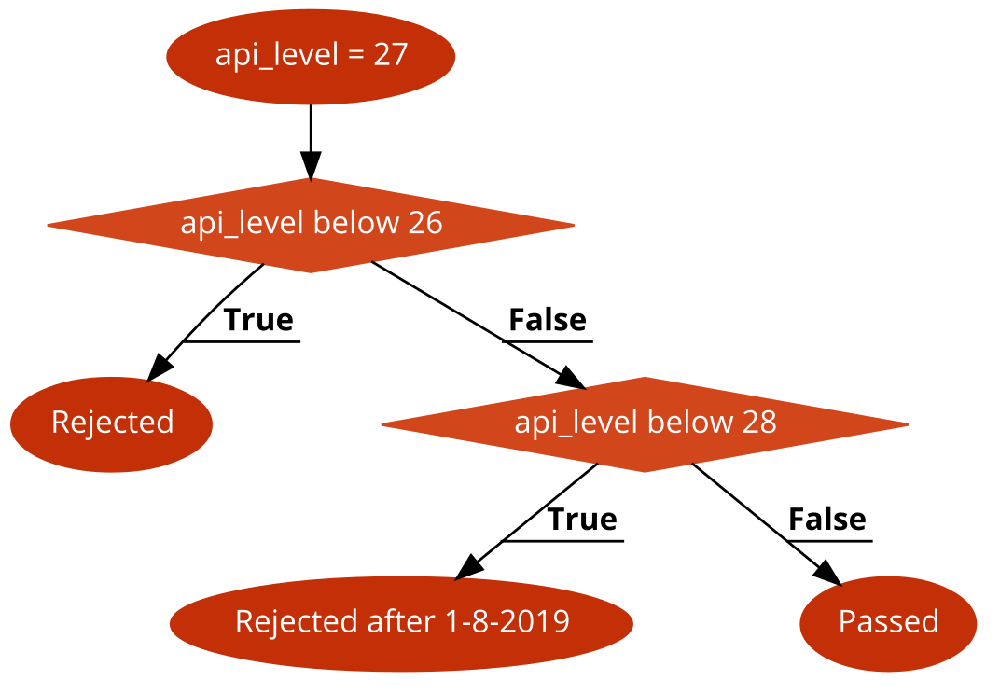
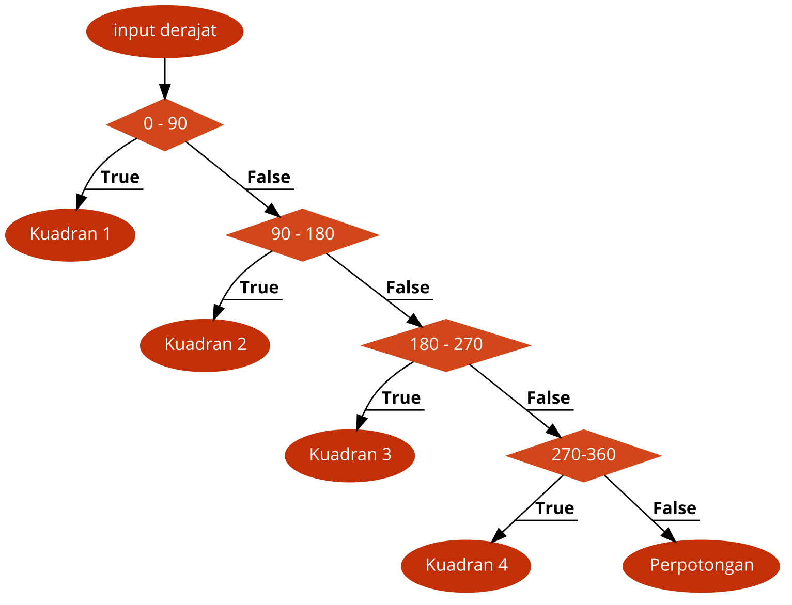

# Latihan Pekan 2: Struktur Kendali I

**Dasar-Dasar Pemrograman 0** | Penulis: Muhammad Dzikra Muzaki, Rafi Muhammad Daffa

## Daftar Isi

Materi Pekan 2

L1. Konversi Grafik ke Struktur Kendali

L2. Konversi Masalah ke Struktur Kendali

L3. Latihan Pemrograman

## L1. Konversi Grafik ke Struktur Kendali

Konversikan bentuk-bentuk grafik percabangan di bawah ini menjadi sebuah ekspresi Python dengan menggunakan struktur percabangan sehingga dapat mencetak sesuatu sesuai dengan kondisinya!

1. (R - \*) *Target API Level* yang harus dimiliki sebuah aplikasi Android agar dapat dipublikasikan di Play Store.

   

2. (R - \*) Pencarian kuadran sebuah sudut dalam derajat di mana sudut 0, 90, 180, 270, dan 360 tidak termasuk kuadran manapun (menjadi perpotongan) dan sudut tidak melebihi 360 derajat.

   

## L2. Konversi Masalah ke Struktur Kendali

Buatlah sebuah program yang dapat menangani masalah-masalah ini:

1. **(R - \*) Perhitungan Nilai Mutlak**

   > **Dilarang** menggunakan fungsi abs() pada soal ini.

   Input: Sebuah angka

   Output: Nilai mutlak dari angka tersebut

2. **(R - \*) Penentuan Tahun Kabisat**

   Input: Sebuah tahun

   Output: Apakah tahun tersebut kabisat atau tidak

   Sebuah tahun adalah kabisat jika memenuhi salah satu dari kriteria ini:

   1. Tahun tersebut habis dibagi 4 dan tidak habis dibagi 100
   2. Tahun tersebut habis dibagi 400

3. **(R - \**) Penentuan Hari yang Akan Datang**

   Input: Nama hari (Senin - Minggu) dan jarak hari (misal 100 hari)

   Output: Hari yang jatuh pada x hari sejak nama hari yang dimasukkan.

   Hint: Translasi hari ke angka dapat memanfaatkan List.

4. **(R - \*\*\*) Diskriminan dan Akar Persamaan Kuadrat**

   Input: Nilai a, b, dan c

   Output: Nilai diskriminan dan akar-akarnya (bila ada)

   

   Rumus Diskriminan:
   $$
   \begin{align*}
   D=b^2 - 4ac
   \end{align*}
   $$
   D > 0: Mempunyai dua akar unik

   D = 0: Mempunyai akar kembar

   D < 0: Tidak mempunyai akar real

   

   Rumus Akar:
   $$
   \begin{align*}
   x_{1,2}= \frac{-b \pm \sqrt{b^2 - 4ac}}{2a}
   \end{align*}
   $$

## L3. Latihan Pemrograman

#### 1. (R - **) Pencarian Lokasi Stasiun

Setiap stasiun di Tokyo Metro memiliki kode stasiun yang didesain agar penglaju dapat menggunakan layanan Tokyo Metro terlepas dari pemahaman bahasa setempat. Kode tersebut memiliki format **X-YY** di mana X adalah kode huruf dari jalur yang menggunakan stasiun tersebut dan YY adalah nomor urut stasiun tersebut pada jalur yang sesuai.

Contoh:

1. Stasiun Kita-Senju dengan kode C-18 berarti merupakan stasiun ke-18 dari jalur Chiyoda Line.
2. Stasiun Shibuya dengan kode Z-01 berarti merupakan stasiun pertama dari jalur Hanzomon Line.

| Kode | Jalur           | Nomor Stasiun    |
| ---- | --------------- | ---------------- |
| G    | Ginza Line      | G-01 sampai G-19 |
| M    | Marunochi Line  | M-01 sampai M-25 |
| H    | Hibiya Line     | H-01 sampai H-21 |
| T    | Tozai Line      | T-01 sampai T-23 |
| C    | Chiyoda Line    | C-01 sampai C-20 |
| Y    | Yurakucho Line  | Y-01 sampai Y-24 |
| Z    | Hanzomon Line   | Z-01 sampai Z-14 |
| N    | Namboku Line    | N-01 sampai N-19 |
| F    | Fukutoshin Line | F-01 sampai F-16 |

Buatlah sebuah program yang dapat menentukan jalur dari sebuah stasiun berdasarkan kode stasiun yang dimasukkan oleh pengguna. Program tersebut juga harus mampu mengecek apakah stasiun tersebut ada atau tidak (misal. kode stasiun G-20 tidak valid karena Ginza Line hanya sampai G-19).

#### 2. (R - multiple) ISBN

*International Standard Book Number* (ISBN) merupakan sistem penomoran universal yang digunakan sebagai kode unik dari suatu buku yang dipublikasikan. Saat ini, ada dua edisi yang digunakan:

1. **ISBN-10**: Digunakan oleh buku yang dipublikasikan sebelum Desember 2006 dan menggunakan 10 karakter.
2. **ISBN-13**: Digunakan oleh buku yang dipublikasikan setelah Desember 2006 dan menggunakan 13 karakter dengan menambah 3 karakter di depannya (antara 978 atau 979).

Sebuah nomor ISBN terbagi menjadi 5 bagian utama:

1. **Elemen Prefiks**: (hanya untuk ISBN-13) Antara 978 atau 979.
2. **Elemen Grup Registrasi**: Nomor yang merepresentasikan asal dari buku tersebut berdasarkan negara, bahasa, atau daerahnya (Indonesia menggunakan nomor 602, 623, dan 979).
3. **Elemen Pendaftar**: Nomor yang merepresentasikan penerbit dari buku tersebut.
4. **Elemen Publikasi**: Nomor yang merepresentasikan buku itu sendiri.
5. ***Check Digit***: 1 karakter yang didedikasikan sebagai pengecek integritas dari sebuah nomor ISBN.

##### 2A. (**) Pengecekan Grup Registrasi

Buatlah sebuah program yang dapat mengecek bahwa suatu buku dipublikasikan di Indonesia atau tidak. Program tersebut harus mampu menerima kedua edisi dari ISBN, baik ISBN-10 maupun ISBN-13.

##### 2B. (\*\*\* to \*\*\*\*) Pengecekan Integritas Nomor ISBN-13

> Disclaimer: Soal ini **bisa** diselesaikan tanpa pola perulangan (<code>for</code>).

ISBN-13 menggunakan sebuah algoritma bernama *Luhn Algorithm* atau *Modulo-10 Algorithm* untuk mengecek bahwa suatu nomor ISBN-13 sesuai dengan peraturan yang berlaku dan menunjuk ke buku yang benar. Amati tabel di bawah ini:

Buku 1 (9780133760637):

| 9    | 7    | 8    | 0    | 1    | 3    | 3    | 7    | 6    | 0    | 6    | 3    | 7    |
| ---- | ---- | ---- | ---- | ---- | ---- | ---- | ---- | ---- | ---- | ---- | ---- | ---- |
| I0   | I1   | I2   | I3   | I4   | I5   | I6   | I7   | I8   | I9   | I10  | I11  | CD   |

Buku 2 (9780073383095):

| 9    | 7    | 8    | 0    | 0    | 7    | 3    | 3    | 8    | 3    | 0    | 9    | 5    |
| ---- | ---- | ---- | ---- | ---- | ---- | ---- | ---- | ---- | ---- | ---- | ---- | ---- |
| I0   | I1   | I2   | I3   | I4   | I5   | I6   | I7   | I8   | I9   | I10  | I11  | CD   |

Cara kerja *Luhn Algorithm* pada nomor ISBN-13 adalah:

1. Ambil 12 angka pertama dari sebuah nomor ISBN-13 (I0 - I11 pada tabel).

2. Angka yang menempati indeks genap (0,2,4,6,8,dst.) memiliki bobot 1.

3. Angka yang menempati indeks ganjil (1,3,5,7,9,dst.) memiliki bobot 3.

4. Jumlahkan semua angka yang diambil tadi sesuai dengan bobotnya.

   Contoh pada Buku 1: (9+8+1+3+6+6)+(7+0+3+7+0+3)*3 = 93

   Contoh pada Buku 2: (9+8+0+3+8+0)+(7+0+7+3+3+9)*3 = 115

5. Bagi hasil penjumlahan pada nomor 4 dengan 10 kemudian ambil sisa baginya.

   Contoh pada Buku 1: 93/10 = 9 sisa 3

   Contoh pada Buku 2: 115/10 = 11 sisa 5

6. Kurangi 10 dengan sisa pembagi tadi untuk mendapatkan *check digit* (CD)-nya.

   Contoh pada Buku 1: 10 - 3 = 7

   Contoh pada Buku 2: 10 - 5 = 5

   (Apabila hasilnya 10, maka *check digit*-nya adalah X)

7. Apabila hasil perhitungan ini sama dengan digit terakhir dari nomor ISBN-13 tersebut, maka nomor ISBN-13 tersebut *valid*.

Buatlah sebuah program yang dapat menerima nomor ISBN 13 digit (asumsikan seperti itu) dan cek apakah nomor ISBN-13 tersebut *valid* atau tidak.