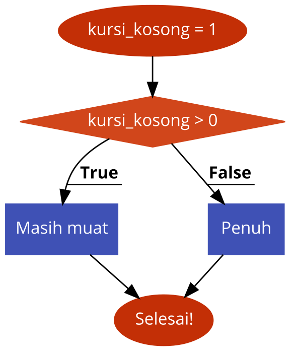
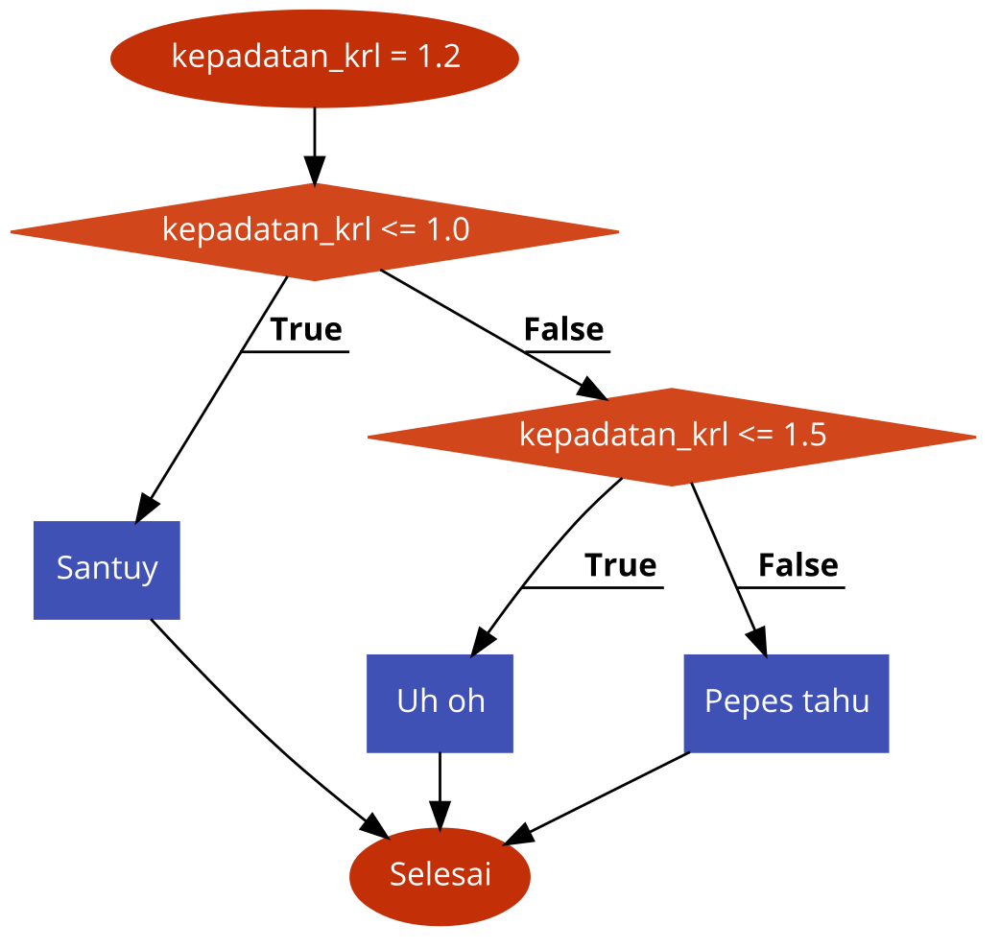

# Struktur Kendali I

**Dasar-Dasar Pemrograman 0** | Penulis: Harnindyto Wicaksana, Muhammad Azis Husein, Rafi Muhammad Daffa


## Daftar Isi

2A. Pembuatan Program Sederhana

2B. Struktur Pengambilan Keputusan

2C. Masukan dan Keluaran Sederhana

2L. Latihan


## 2A. Pembuatan Program Sederhana

Pada materi "Mengenal IDLE dan Shell", kamu sudah diperkenalkan dengan Python Shell sebagai salah satu cara untuk mencoba-coba ekspresi Python. Namun, kamu tidak dapat merangkai suatu program panjang tanpa menjalankannya setiap menyelesaikan suatu blok (biasanya hanya satu baris atau beberapa baris dalam kondisi tertentu). Untuk menyusun rangkaian program tersebut, kamu perlu menuliskannya dalam sebuah berkas, menyimpannya, dan memerintahkan Python untuk menjalankan berkas tersebut.

### Berkas Program Python (<code>.py</code>)

Umumnya, berkas yang menaungi untaian ekspresi-ekspresi yang tergabung menjadi suatu program Python memiliki tipe <code>.py</code>. Berkas ini berfungsi baik sebagai berkas teks di mana program Python ditulis maupun sebagai berkas yang dapat dijalankan sebagai program. Hal ini menjadi mungkin karena proses konversi dari program yang disusun secara *high-level* (mendekati bahasa manusia) menuju bahasa mesin dilakukan secara otomatis oleh *interpreter*. Bahasa pemrograman lain seperti Java atau C++ mengharuskan pemrograman untuk melalui proses konversi tersebut (yang dinamakan proses *compiling*) dan menjalankan berkas hasil konversi tersebut.

Dwifungsi berkas ini memungkinkan pemrograman untuk melakukan proses penyusunan kode Python dengan berbagai macam aplikasi penyunting teks, mulai dari penyunting teks sederhana seperti <code>nano</code> atau <code>vi</code>, sampai ke IDE kompleks seperti PyCharm. IDLE yang dibawa oleh instalasi Python berada di tengah spektrum tersebut, di mana program dibuat lebih sederhana dari IDE namun memiliki integrasi langsung dengan Python sehingga program yang sudah disusun dapat dicoba dengan mudah.

### Membuat Program Python dengan IDLE

Apabila IDLE sudah dijalankan dan memunculkan Shell, kamu dapat meminta IDLE untuk menyediakan sebuah berkas kosong untuk tempat menulis program layaknya kamu membuat berkas baru pada aplikasi penyunting teks. Ada setidaknya dua cara untuk membuat berkas baru tersebut:

1. **Cara GUI**: Pada *status bar* yang terletak di atas, pilih <code>File</code> > <code>New File</code>.
2. **Cara Keyboard**: Gunakan kombinasi <code>Ctrl</code> + <code>N</code> (Windows/Linux) atau <code>Command</code> + <code>N</code> (macOS).

Berkas kosong tersebut dapat diisi program Python dengan jumlah baris tidak terbatas dan Python tidak akan menjalankan apapun yang dibuat pada berkas tersebut kecuali diminta secara eksplisit oleh pengguna. Coba salin program ini secara utuh, dari awal sampai akhir, baik ke Shell maupun ke berkas kosong yang sudah kalian buat. Bandingkan umpan balik yang diberikan oleh IDLE!

~~~python
print("Viva")
print("Viva")
print("Fasilkom")
~~~

Pada Shell, pergantian baris yang ada pada program di atas pada baris pertama dan kedua mengakibatkan baris pertama dan kedua dijalankan secara langsung oleh Python (sama seperti ketika kamu menekan Enter secara manual). Pada berkas kosong tadi, program yang disalin tidak dijalankan karena di sana IDLE bertindak sebagai penyunting teks. Untuk menjalankan program yang ada pada berkas tersebut, kamu harus meminta secara eksplisit kepada IDLE untuk menjalankannya dengan cara:

1. (*best practice*) Simpan terlebih dahulu berkas yang sudah kamu buat di tempat yang mudah dijangkau. Secara *default*, Python akan mengusulkan untuk menyimpan di tempat Python terpasang yang merupakan tempat sulit dijangkau.
2. **Cara GUI**: Pada *status bar* yang terletak di atas, pilih <code>Run</code> > <code>Run Module</code>.
3. **Cara Keyboard**: Gunakan <code>F5</code> atau kombinasi <code>Fn</code> + <code>F5</code>.

Terlepas dari kondisi "tersimpan" dari berkas yang dibuat, IDLE akan mengecek hal tersebut saat akan menjalankan program dan akan memberikan peringatan ketika berkas belum disimpan. Namun, *best practice* di atas akan menyelamatkanmu dari hal-hal tidak terduga (*ekhm BSOD).

Ketika dijalankan, Shell akan menjalankan semua baris dari berkas tersebut secara berurutan dari atas ke bawah sesuai dengan ekspresi yang dituliskan pada berkas tersebut. Selama program tersebut berjalan, kamu tidak dapat mengetikkan ekspresi Python seperti sebelumnya. Fungsi Shell akan kembali seperti semula ketika program sudah selesai dijalankan (baik sempurna maupun tidak).

> **Try it!**
>
> Cobalah untuk membuat suatu program Python di mana terdapat 3 variabel (Nama kamu, alasan kenapa masuk Fasilkom UI, dan ekspektasi kamu dalam mengikuti DDP0). Kemudian, buat perintah untuk mencetak ketiga data tersebut dengan format seperti ini:
>
> ~~~python
> Nama: <nama>
> Alasan masuk Fasilkom UI: <alasan>
> Ekspektasi di DDP0: <ekspektasi>
> ~~~
>
> Jangan lupa untuk menyimpan berkas yang sudah dibuat dan coba dijalankan di IDLE.

### Membuat Program Python dengan Aplikasi Non-IDLE

Karena berkas program Python pada dasarnya merupakan suatu berkas teks yang dapat dijalankan, program Python dapat dirancang dengan berbagai macam aplikasi. Beberapa aplikasi tersebut bahkan menawarkan fitur yang sama atau bahkan lebih dari IDLE itu sendiri, seperti Visual Studio Code, Sublime Text, dan PyCharm. Program Python dapat ditulis seperti biasa pada aplikasi masing-masing dan disimpan sebagai berkas <code>.py</code>. Terlepas dari aplikasi yang digunakan, program Python dapat dijalankan melalui cara umum sebagai berikut:

1. Jalankan Command Prompt/Powershell/Bash/Terminal/aplikasi sejenis

2. Lakukan navigasi ke folder tempat berkas disimpan (bila perlu) dengan menggunakan perintah:

   ~~~
   cd "<alamat>"
   ~~~

   Contoh:

   ~~~shell
   cd "C:\Users\Author\Documents\Coding Repositories\DDP0"
   ~~~

3. Gunakan perintah berikut untuk menjalankan berkas Python secara langsung (tanpa melalui IDLE):

   ~~~
   # Apabila hanya Python 3.x yang terpasang
   python <nama file>.py
   
   # Apabila ada Python 2.x yang terpasang
   python3 <nama file>.py
   ~~~

   Contoh:

   ~~~shell
   python WarshallCalculator.py
   python3 WarshallCalculator.py
   ~~~

4. Python akan diaktifkan sementara dan menjalankan program sampai selesai kemudian menutupnya.

Selain melalui cara di atas, apabila tidak ada program lain yang diasosiasikan sebagai program yang menangani berkas <code>.py</code>, kamu dapat menjalankan berkas tersebut dengan *double-click* layaknya membuka berkas biasa.


## 2B. Struktur Pengambilan Keputusan

Dalam hampir semua aspek kehidupan, kita dihadapkan dengan pilihan. Mulai dari aktivitas yang dilakukan untuk mengisi waktu luang hingga cita-cita yang ingin dicapai di masa depan, kita harus mampu untuk mengambil keputusan terhadap pilihan apa yang akan kita pilih. Setiap pilihan yang diambil memiliki rangkaian kejadian masing-masing sebagai konsekuensi dari pengambilan keputusan tersebut.

Pengambilan keputusan dalam pemrograman bekerja dengan prinsip yang serupa. Program dapat disusun sedemikian rupa sehingga alurnya dapat dipengaruhi oleh suatu kondisi baik yang merupakan sifat intrinsik dari program itu sendiri maupun yang merupakan dorongan eksternal (seperti masukan dari pengguna atau sistem). Sistem ini merupakan komponen mendasar dalam alur pemrograman mulai dari program yang kondisi-kondisi pengambilan keputusannya diatur secara eksplisit oleh perancang program hingga *Artificial Intelligence* yang mampu membuat keputusan secara otonom.

Struktur pengambilan keputusan pada pemrograman pada umumnya berbentuk *suite* <code>if</code>-<code>else</code>. Dalam Python, *suite* ini memiliki kata kunci tambahan sehingga menjadi <code>if</code>-<code>elif</code>-<code>else</code> di mana <code>elif</code> merupakan singkatan dari <code>else if</code>. Amati grafik di bawah ini:



Dalam representasi program pengecekan ketersediaan kursi kosong di atas, pertama dilakukan deklarasi variabel <code>kursi_kosong</code> dengan nilai 1. Untuk memberikan hasil yang sesuai kepada pengguna tentang ketersediaan kursi, program harus membuat keputusan tentang hasil yang akan diberikan kepada pengguna berdasarkan isi dari variabel <code>kursi_kosong</code> tersebut. Pada program di atas, terjadi percabangan yang bergantung pada pengambilan keputusan apakah variabel <code>kursi_kosong</code> memiliki nilai lebih dari 0 atau tidak. Apabila kondisi tersebut benar, maka alur program akan menghasilkan "Masih muat". Sebaliknya, apabila kondisi tersebut salah, alur program akan menghasilkan "Penuh". Dalam hal ini, kondisi benar karena 1 > 0, sehingga "Masih muat" akan dihasilkan.

### Pengambilan Keputusan dengan Satu Kondisi

Pengambilan keputusan yang bergantung pada satu kondisi dapat dirancang dengan hanya menggunakan <code>if</code> dan <code>else</code>. Dalam Python, struktur pengambilan keputusan satu kondisi ini adalah sebagai berikut:

~~~
if suatu_kondisi:
	blok yang jalan jika benar
else:
	blok yang jalan jika salah
~~~

> **Perhatikan indentasinya!**

Program pengecekan ketersediaan kursi kosong yang sebelumnya dibahas dapat diimplementasikan sebagai berikut:

~~~python
kursi_kosong = 1
if kursi_kosong > 0:
    print("Masih muat")
else:
    print("Penuh")
print("Selesai")
~~~

Hasil yang dicetak pada layar adalah sebagai berikut:

~~~
Masih muat
Selesai
~~~

Penjelasan:

1. <code>kursi_kosong > 0</code> adalah operasi pembanding (dibahas pada subbab 1C) yang akan membandingkan isi dari variabel <code>kursi_kosong</code> dengan <code>0</code> dan menghasilkan sebuah nilai Boolean sesuai hasil evaluasi operasi tersebut (dalam hal ini True).
2. Kondisi True akan membuat blok yang ada di dalam <code>if</code> untuk berjalan dan yang ada di dalam <code>else</code> untuk tidak berjalan sehingga "Masih muat" tercetak.
3. <code>print("Selesai")</code> tidak termasuk blok manapun sehingga tetap dicetak, apapun kondisinya.

Masing-masing dari <code>if</code> dan <code>else</code> memiliki blok program yang ditandai dengan titik dua dan diikuti oleh indentasi satu tingkat (umumnya ekuivalen dengan 4x spasi). Blok program tersebut mengikuti kondisi sebagai berikut:

1. Blok program yang ada di dalam <code>if</code> akan dijalankan jika dan hanya jika kondisi yang diberikan (operasi pembanding) dievaluasi sebagai True. 
2. Blok program yang ada di dalam <code>else</code> akan dijalankan jika dan hanya jika kondisi yang diberikan (operasi pembanding) pada <code>if</code> dievaluasi sebagai False.

> **Penggunaan Boolean dalam Struktur Percabangan**:
>
> Jika kamu sudah memiliki suatu variabel yang berisi sebuah nilai Boolean, program dapat disusun seperti berikut ini dengan memanfaatkan syarat berjalannya masing-masing blok:
>
> ~~~python
> status = True
> if status:
> 	print("OK")
> else:
> 	print("Not OK")
> ~~~

Cobalah untuk mencari hasil dari masing-masing program berikut ini!

~~~python
ukuran_ram = 16
tab_chrome = 5
if tab_chrome >= 20 and ukuran_ram <= 4:
    print("RIP")
~~~

~~~python
serial_number = "K1 0 01 18 SMC"
if serial_number[:2] == "K1":
    print("Kereta Eksekutif")
else:
    print("Bukan Kereta Eksekutif")
~~~

~~~python
my_var = ""
if my_var:
	print("Hurray")
else:
	print("Yeay")
~~~

### Pengambilan Keputusan dengan Kondisi Majemuk

Terkadang perbedaan dalam kehidupan itu tidak semudah perbedaan hitam dan putih. Dengan gagalnya suatu kondisi untuk diasosiasikan dengan sebuah blok <code>if</code> belum tentu berarti semuanya dapat digeneralisasi menjadi sebuah blok <code>else</code>. Seringkali, ada kondisi lain yang harus diperiksa dan dijadikan pertimbangan dalam mengambil keputusan. Amati grafik berikut ini:



Penjelasan:

1. Program membuat sebuah variabel <code>kepadatan_krl</code> dengan nilai 1.2 (dalam konteks ini, 120%).
2. Program menghadapi percabangan pertama di mana jika <code>kepadatan_krl</code> memiliki nilai kurang dari atau sama dengan 1.0 (dalam konteks ini, 100%), maka keluarannya adalah "Santuy".
3. Jika nilai <code>kepadatan_krl</code> lebih dari 1.0 (kondisi dievaluasi sebagai False), program akan menemui percabangan kedua di mana jika <code>kepadatan_krl</code> memiliki nilai kurang dari atau sama dengan 1.5 (dalam konteks ini, 150%), maka keluarannya adalah "Uh oh" (Program akan menempuh jalur ini).
4. Jika seandainya nilai <code>kepadatan_krl</code> masih lebih dari 1.5, program akan menempuh jalur yang menghasilkan keluaran "Pepes tahu".

Rancangan program yang dijelaskan di atas merupakan salah satu contoh struktur percabangan dengan kondisi majemuk. Pada program tersebut, ada dua kondisi yang mengendalikan alur program dan menghasilkan tiga kemungkinan keluaran. Program di atas sebenarnya dapat diimplementasikan dengan menurunkan struktur percabangan dengan satu kondisi seperti di bawah ini:

~~~python
kepadatan_krl = 1.2
if kepadatan_krl <= 1.0:
    print("Santuy")
else:
    if kepadatan_krl <= 1.5:
        print("Uh oh")
    else:
        print("Pepes tahu")
print("Selesai")
~~~

Hasilnya adalah sebagai berikut:

~~~
Uh oh
Selesai
~~~

Namun, struktur percabangan seperti di atas akan menyulitkan penyusunan program, khususnya yang memerlukan kondisi sangat banyak (8, 10, 12, dan lain-lain). Struktur percabangan dapat diibaratkan sebagai ranting di mana pada program di atas, perpecahan terjadi sebanyak dua kali. Pertama, rantingnya terpecah menjadi dua. Kemudian, ranting <code>else</code> hasil pecahan tadi akan terpecah kembali menjadi dua. Untuk memudahkan dalam struktur program seperti ini, Python menyediakan kata kunci <code>elif</code> yang merupakan singkatan dari <code>else if</code> dan dapat digunakan untuk memusatkan pemecahan di awal (secara tertulis) sehingga memudahkan penulisan. Contohnya:

~~~python
kepadatan_krl = 1.2
if kepadatan_krl <= 1.0:
    print("Santuy")
elif kepadatan_krl <= 1.5:
    print("Uh oh")
else:
    print("Pepes tahu")
print("Selesai")
~~~

Program ini dan program sebelumnya memiliki perilaku yang sama. Namun, kali ini kamu hanya perlu memberikan indentasi sebanyak satu kali. Dengan menggunakan <code>elif</code>, percabangan yang dibuat akan menjadi lebih *scalable* jika misalnya sewaktu-waktunya kamu ingin menambahkan kondisi tambahan. Penambahan tersebut hanya perlu dilakukan dengan menambah satu blok <code>elif</code> sebelum <code>else</code> tanpa harus memikirkan jumlah indentasi >1. Secara umum, struktur percabangan seperti ini memiliki rancangan sebagai berikut:

~~~
if kondisi_1:
	Blok jika Kondisi 1 benar
elif kondisi_2:
	Blok jika Kondisi 1 salah dan Kondisi 2 benar
elif kondisi_3:
	Blok jika Kondisi 1&2 salah dan Kondisi 3 benar
....(tambahkan blok elif sesuai kebutuhan)
else:
	Blok jika semua Kondisi salah
Percabangan selesai, program lanjut
~~~

> **Pentingnya indentasi**:
>
> Salin program berikut ini apa adanya ke IDLE dan coba untuk dijalankan. Amati hal yang terjadi!:
>
> ~~~
> sebuah_angka = 70
> if sebuah_angka < 10:
> print("Satuan")
> elif sebuah_angka < 100:
> print("Puluhan")
> elif sebuah_angka < 1000:
> print("Ratusan")
> ~~~
>
> Jika program tersebut dijalankan apa adanya, Python akan memberikan sebuah *error* yang berkaitan dengan format penulisan. Cobalah untuk mengoreksi program di atas sehingga dapat mencetak keluaran yang sesuai.

Carilah hasil dari program berikut ini:

~~~python
sebuah_angka = 10
if sebuah_angka <= 20:
    sebuah_angka += 15
elif sebuah_angka <= 30:
    sebuah_angka += 20
else:
    sebuah_angka += 100
print(sebuah_angka)
~~~


## 2C. Masukan dan Keluaran Sederhana

Setelah mempelajari bagaimana percabangan dapat memengaruhi alur program, langkah selanjutnya adalah memanfaatkan percabangan tersebut untuk memberikan kendali bagi pengguna untuk memengaruhi alur program. Misalnya, kamu ingin merancang sebuah program yang dapat menyapa pengguna sesuai dengan nama yang ia masukkan ke program. Atau kamu ingin merancang sebuah program yang dapat membantu pengguna dalam menghitung suatu rumus Fisika kompleks. Di sinilah kamu mulai membutuhkan masukan dari pengguna.

### *Onboarding*: Notasi Fungsi dalam Python

Dalam menggunakan fungsi di Python, akan ada situasi di mana sebuah fungsi memiliki sistem parameter yang kompleks sehingga membutuhkan kemampuan khusus untuk membaca notasi fungsi yang diberikan pada dokumentasi yang tersedia. Topik ini akan dibahas lebih dalam pada Pekan 03 dan anak sub-bab ini bersifat sebagai pengenalan untuk menggunakan tiga fungsi yang akan dibahas selanjutnya, yakni <code>input()</code>, <code>print()</code>, dan <code>eval()</code>.

Setiap fungsi, layaknya dalam matematika, memiliki argumen yang memengaruhi perilaku dari fungsi tersebut. Bedanya, suatu fungsi dalam pemrograman boleh tidak memiliki argumen sama sekali. Ada dua cara untuk memberikan argumen dalam Python:

1. **Positional Argument**: Argumen yang dipetakan sesuai dengan urutan penempatannya.

   Contoh notasi:

   ~~~
   power(x,y)
   ~~~

   Contoh penggunaan:

   ~~~
   power(1,2)
   ~~~

   Berarti, pemanggilan fungsi <code>power(1,2)</code> akan memetakan x ke 1, dan y ke 2.

2. **Keyword Argument**: Argumen yang dipetakan sesuai dengan variabel argumen yang diberikan saat fungsi tersebut dirancang.

   Contoh notasi:

   ```
   power(x,y)
   ```

   Contoh penggunaan:

   ```
   power(y=2,x=1)
   ```

   Meskipun secara posisi terbalik, Python akan tetap memetakan x ke 1 dan y ke 2.

Ada beberapa kasus di mana argumen tertentu harus diberikan sebagai *keyword argument*.

Contoh notasi fungsi di mana <code>custom_arg</code> harus diberikan sebagai *keyword argument*:

~~~
my_function(*positional_collection, custom_arg=0)
~~~

Contoh penggunaan:

~~~
my_function(1,2,3,4,5,6,custom_arg=100)
~~~

> **Catatan**:
>
> Sebuah argumen dapat memiliki sebuah nilai *default* di mana ketika tidak ditemukan nilai untuk dipetakan ke argumen tersebut saat dipanggil, nilai *default* akan dipanggil.
>
> Contoh notasi:
>
> ~~~
> power(x,y=1)
> ~~~
>
> Contoh penggunaan dengan nilai tidak lengkap:
>
> ~~~
> power(2)
> ~~~
>
> Maka, Python akan secara otomatis menggunakan nilai *default* untuk y.

### <code>input()</code>

> **Notasi Fungsi**
>
> ~~~
> input(prompt=None)
> ~~~
>
> Daftar argumen:
>
> <code>prompt</code> (Positional/Keyword): Permintaan yang akan ditampilkan kepada pengguna saat proses masukan berlangsung (default None / tidak ada permintaan yang ditampilkan).

Fungsi <code>input()</code> digunakan untuk menerima masukan dari pengguna dan mengembalikannya dalam bentuk String kepada siapapun yang memanggilnya. Umumnya, fungsi <code>input()</code> ini digunakan untuk mengisi suatu variabel sehingga umumnya fungsi ini dipanggil oleh variabel. Jika digunakan tanpa variabel, hasil masukan akan tersimpan di blok memori namun tidak dapat dipanggil dan menjadi sampah.

Contoh penggunaan:

~~~python
username = input("Enter your name: ")
height = input("Insert your height: ")
~~~

Pada saat program dijalankan,  program akan rehat sejenak (tidak berhenti) pada pemanggilan fungsi untuk menunggu masukan dari pengguna. Pengguna dapat mengetikkan argumen sepanjang apapun selama tombol <code>Enter</code> belum ditekan. Tombol tersebut merupakan sinyal bagi Python bahwa pengguna telah selesai memberikan masukan dan program dapat dilanjutkan.

Apabila contoh penggunaan dijalankan, tahapan yang ditempuh adalah:

1. Program akan meminta masukan untuk variabel <code>username</code>.

   (Tampilan di Shell)

   ~~~
   Enter your name:
   ~~~

2. Setelah masukan selesai diberikan ke variabel yang berhak, program akan meminta masukan untuk variabel <code>height</code>.

   (Tampilan di Shell)

   ~~~
   Enter your name: Harnin Todi
   Enter your height:
   ~~~

3. Program selesai setelah masukan selesai diberikan ke variabel yang berhak.

   (Tampilan di Shell)

   ~~~
   Enter your name: Harnin Todi
   Enter your height: 170
   >>>
   ~~~

Perlu dicatat bahwa semua masukan yang diberikan oleh pengguna (terlepas dari tipe data yang seharusnya merepresentasikan masukan tersebut) akan diperlakukan sebagai sebuah String. Apabila kamu merasa yakin terhadap tipe dari data yang akan dimasukkan oleh pengguna, kamu dapat membungkus pemanggilan fungsi tersebut dengan *type casting* (dibahas pada subbab 1C) sesuai dengan tipe data yang diinginkan.

Contoh:

~~~python
username = input("Enter your name: ")
height = int(input("Insert your height: "))
~~~

Dalam hal ini, masukan pengguna untuk variabel <code>height</code> akan dikonversi menjadi Integer sebelum dipetakan ke sebuah variabel. Seperti pada *type casting*, struktur ini harus digunakan dengan bijak karena merupakan salah satu *point of failure*.

Coba amati hasil dari program di bawah ini:

~~~python
random_input = bool(input("try press enter"))
print(random_input)
~~~

### <code>print()</code>

> **Notasi fungsi**
>
> ~~~
> print(*value, sep=' ', end='\n', file=sys.stdout, flush=False)
> ~~~
>
> Daftar argumen:
>
> <code>value</code> (Positional, Infinite): Objek yang akan dicetak (bisa berapa pun dan sepanjang apapun). Pemisahan antar-objek dilakukan dengan tanda koma dan akan dicetak dengan pemisah yang didefinisikan oleh <code>sep</code>.
>
> <code>sep</code> (Keyword): String yang memisahkan antar-objek yang dicetak (default <code> </code> - Spasi).
>
> <code>end</code> (Keyword): String yang ditambahkan di akhir proses pencetakan dan digunakan sebagai pemisah antara pencetakan yang dilakukan dengan fungsi tersebut dan fungsi selanjutnya (default <code>\n</code> - Representasi dari Enter/baris baru).
>
> <code>file</code> (Keyword): Tujuan dari hasil pencetakan (default <code>sys.stdout</code> - mengeluarkan ke *interpreter* yang akan dioper ke Shell untuk ditampilkan di Shell).
>
> <code>flush</code> (Keyword): Apakah benda yang akan dicetak harus langsung di-*flush* (dikeluarkan) atau menunggu antrian *buffer* sistem (default <code>False</code> - menunggu antrian *buffer* sistem).

Fungsi <code>print()</code> digunakan untuk mengeluarkan sesuatu dalam bentuk String ke Shell (*default*) maupun ke sebuah berkas teks (memodifikasi argumen <code>file</code>). Fungsi ini dapat mencetak benda apapun yang memiliki representasi String (dapat dicek dengan menggunakan *type casting* String) di mana benda non-String apapun yang dijadikan argumen akan secara implisit di-*cast* ke String dan dicetak.

Contoh penggunaan:

~~~python
print("first second", "third fourth")
print("first second", "third fourth",sep="and")
~~~

Hasil:

~~~
first second third fourth
first secondandthird fourth
~~~

Cobalah untuk mencari hasil dari program berikut ini!

~~~python
print("is this a real life?", "or is this just a fantasy?", sep="\n" , end = "\t")
print("wait, this is not new line")
~~~

~~~python
print(input("insert an input here\t"))
print("next, ", end = " ")
print(input("another one"), sep="\t")
~~~

### <code>eval()</code>

> **Notasi Fungsi**
>
> ~~~
> eval(source, globals=None, locals=None)
> ~~~
>
> Daftar argumen:
>
> <code>source</code> (Positional): Sebuah String yang mengandung ekspresi Python
>
> <code>globals</code> & <code>locals</code> (Positional): Konteks yang digunakan dalam mengevaluasi ekspresi (default <code>None</code> - menggunakan konteks bawaan Python)

Fungsi <code>eval()</code> merupakan fitur spesial Python yang dapat menerima argumen berupa suatu String yang mengandung ekspresi valid Python dan menghasilkan hasil yang sesuai dengan ekspresi tersebut. Apapun isi dari String yang dijadikan sumber akan diperlakukan seperti ketika kamu mengetikannya langsung di Shell tanpa menggunakan tanda kutip.

Untuk membuktikan hasil dari fungsi ini, kamu dapat menggunakan fungsi <code>type(objek)</code> untuk melihat tipe data dari objek yang dimaksud.

Contoh:

~~~python
number = eval('123')
lst = eval('[1,2,3]')
math_op = eval('12+23')
boolean = eval('True')
comparison = eval('1+1!=3')
logic = eval('True and False')
print(type(number),type(lst),type(math_op),type(boolean),type(comparison),type(logic),sep="\n")
~~~

Hasil:

~~~
<class 'int'>	# Tipenya Integer
<class 'list'>	# Tipenya List
<class 'int'>	# Tipenya Integer
<class 'bool'>	# Tipenya Boolean
<class 'bool'>	# Tipenya Boolean
<class 'bool'>	# Tipenya Boolean
~~~

Secara sederhana, fungsi ini akan meminta Python untuk menghilangkan pengapit tanda kutip **terluar** yang merupakan penanda tipe data String sehingga isinya bisa dievaluasi. Maka dari itu, sebuah String yang tidak dapat dievaluasi sebagai ekspresi Python tidak dapat dikembalikan menjadi String dan akan menimbulkan *error*.

Contoh:

~~~python
# Tidak valid
eval("A")

# Valid (kutip satu di dalam dipertahankan dan dievaluasi menjadi String)
eval("'A'")
~~~

