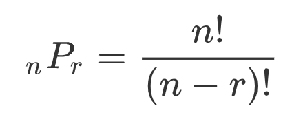
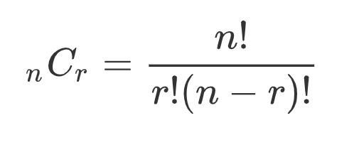

# Latihan Pekan 3 dan 4

**Dasar-Dasar Pemrograman 0** | Penulis: Rafi Muhammad Daffa

## Daftar Isi

Materi Pekan 3

Materi Pekan 4

L1. Penggunaan Fungsi <code>range()</code>

L2. Konversi Masalah ke Struktur Kendali

L3. Latihan Pemrograman

L4. Bonus

## L1. Penggunaan Fungsi <code>range()</code>

(R - *) Carilah nilai argumen dari masing-masing penggunaan fungsi <code>range</code> sehingga dapat menghasilkan hasil seperti yang diminta. Jumlah argumen yang digunakan harus sama dengan slot yang disediakan. Contohnya, apabila disediakan <code>arg1</code> dan <code>arg2</code>, maka kamu harus menggunakan dua argumen untuk menyusun urutannya.

1. ~~~python
   for num in range(arg1):
       print(num, end=" ")
   ~~~

   Hasil:

   ~~~
   0 1 2 3 4 5 6 7 8 9
   ~~~

2. ~~~python
   for num in range(arg1):
   	print(num*2%5, end=" ")
   ~~~

   Hasil:

   ~~~
   0 2 4 1 3 0 2 4 1 3 0 2
   ~~~

3. ~~~python
   for num in range(arg1,arg2):
       print(num, end=" ")
   ~~~

   Hasil:

   ~~~
   3 4 5 6 7 8 9 10 11 12 13 14 15 16 17 18 19
   ~~~

4. ~~~python
   fav_course = ["DDP1", "DDP2", "PSD", "Matdis 1", "Matdis 2"]
   for num in range(arg1,arg2):
   	fav_course[num] = fav_course[-num]
   print(fav_course)
   ~~~

   Hasil:

   ~~~
   ['DDP1', 'Matdis 2', 'Matdis 1', 'Matdis 1', 'Matdis 2']
   ~~~

5. ~~~python
   for num in range(arg1,arg2,arg3):
       print(num, end=" ")
   ~~~

   Hasil:

   ~~~
   2 5 8 11 14
   ~~~

6. ~~~python
   my_lst = ["Ilmu Komputer", "Satu Banding Seratus", "Kami elit, kami kompak, kami anak UI"]
   for num in range(arg1,arg2,arg3):
       my_lst.insert(num, "Fasilkom")
   print(my_lst)
   ~~~

   Hasil:

   ~~~
   ['Fasilkom', 'Ilmu Komputer', 'Fasilkom', 'Satu Banding Seratus', 'Kami elit, kami kompak, kami anak UI']
   ~~~

   Catatan:

   Perlakuan <code>insert</code> yang dikenakan pada sebuah List menerima argumen pertama berupa sebuah angka indeks dan argumen kedua berupa suatu data yang akan disisipkan pada indeks yang diminta.

## L2. Konversi Masalah ke Struktur Kendali

Buatlah sebuah fungsi yang dapat menangani masalah-masalah berikut ini dan mengembalikan hasil sesuai dengan yang diminta.

1. **(R - \*) Perhitungan Faktorial**

   > Penggunaan modul <code>math</code> pada soal ini **tidak diperkenankan**.

   Argumen fungsi:

   1. <code>x</code>: Sebuah angka yang akan dikenakan operasi faktorial.

   Hasil yang dikembalikan:

   1. <code>None</code> apabila argumen negatif atau bukan angka.
   2. <code>1</code> apabila argumen bernilai 0.
   3. Hasil dari perhitungan faktorial apabila argumen positif.

   Catatan:

   1. Buatlah minimal dua versi dari fungsi ini, menggunakan pola perulangan <code>for</code> dan <code>while</code>.
   2. Apabila sudah paham rekursi, implementasikan perhitungan ini dengan menggunakan rekursi.

2. **(R - \*\*) Perhitungan Kombinasi dan Permutasi**

   > Penggunaan modul <code>math</code> pada soal ini **tidak diperkenankan**.

   Argumen fungsi:

   1. <code>n</code>: Populasi data
   2. <code>r</code>: Jumlah sampel yang diambil

   Hasil yang dikembalikan:

   1. Hasil dari perhitungan kombinasi atau permutasi.

   Catatan:

   1. Buatlah dua versi dari fungsi ini, satu untuk permutasi dan satu untuk kombinasi.

   2. Penggunaan faktorial dalam perhitungan harus menggunakan fungsi yang dibuat pada soal nomor L2.1 (boleh menggunakan versi <code>for</code>, <code>while</code>, maupun rekursi).

   3. Rumus permutasi:

      

   4. Rumus kombinasi:

      

3. **(R - \*\*) Penentuan Tahun Kabisat dalam Rentang Tahun**

   Argumen fungsi:

   1. <code>start</code>: Tahun yang digunakan untuk memulai pencarian tahun kabisat (inklusif)
   2. <code>end</code>: Tahun yang digunakan untuk mengakhiri pencarian tahun kabisat (eksklusif).

   Hasil yang dikembalikan:

   1. Sebuah List yang berisi semua tahun kabisat pada rentang yang diminta.

   Catatan:

   1. Buatlah dua versi dari fungsi ini, menggunakan pola perulangan <code>for</code> dan <code>while</code>.
   2. Syarat sebuah tahun dapat dikatakan kabisat adalah jika memenuhi salah satu dari kriteria ini:
      1. Tahun tersebut habis dibagi 4 dan tidak habis dibagi 100.
      2. Tahun tersebut habis dibagi 400.
   3. Kamu bisa memodifikasi program penentuan tahun kabisat yang telah dibuat pada Pekan 2.

4. **(R - \*\*\*) Pembuatan Poligon dengan <code>turtle</code>**

   Argumen fungsi:

   1. <code>side</code>: Jumlah sisi dari poligon yang akan dibuat.

   2. <code>color</code>: Nama warna yang digunakan dalam mewarnai poligon.

      > Sebagian besar nama warna yang didukung oleh HTML juga dapat digunakan di Turtle. Daftar nama warna HTML dapat kamu lihat di [situs ini](https://htmlcolorcodes.com/color-names/).

   3. <code>pencolor</code> (*default* = None): Nama yang digunakan sebagai warna *border* dari poligon.

   Hasil yang dikembalikan:

   Tidak ada (keluarannya adalah gambar poligon di kanvas Turtle)

   Catatan:

   1. Warna *fill* dan *border* dari poligon dapat diatur sebelum digambar dengan menggunakan fungsi <code>turtle.fillcolor(warna)</code> dan <code>turtle.pencolor(warna)</code>.
   2. Jika pengguna tidak memberikan argumen <code>pencolor</code>, maka gunakan apa yang pengguna masukkan di <code>color</code>.
   3. Untuk membuat sebuah bentuk tertutup, gunakan fungsi <code>turtle.begin_fill()</code> sebelum menggambar dan <code>turtle.end_fill()</code> setelah selesai menggambar.
   4. Apabila menggunakan *editor* selain IDLE yang langsung menutup kanvas setelah gambar selesai dibuat, tambahkan fungsi <code>turtle.exitonclick()</code> agar kamu dapat mengamati hasilnya terlebih dahulu.

## L3. Latihan Pemrograman

### 1. Perhitungan Tarif KRL

> Soal ini diadaptasi dari Tutorial 3 Dasar-Dasar Pemrograman 1 Kelas Ekstensi 2018-2019/2

Pada tanggal 1 Oktober 2016, KRL Commuterline mengganti sistem perhitungan tarif yang semula dihitung dari jumlah stasiun yang dilewati dengan tarif yang dihitung berdasarkan jumlah kilometer yang ditempuh pada perjalanan tersebut. 

Saat ini, tarif yang berlaku adalah:

1. Rp3000 untuk 25 km pertama
2. Rp1000 untuk setiap 10 km selanjutnya (berlaku pembulatan ke atas). 

Tabel jarak masing-masing stasiun pada lintas Bogor-Jakarta Kota adalah sebagai berikut:

| Stasiun               | Jarak dengan Stasiun Setelahnya |
| --------------------- | ------------------------------- |
| Bogor                 | 7.518 km                        |
| Cilebut               | 4.331 km                        |
| Bojong Gede           | 5.197 km                        |
| Citayam               | 5.084 km                        |
| Depok                 | 1.741 km                        |
| Depok Baru            | 2.570 km                        |
| Pondok Cina           | 1.109 km                        |
| Universitas Indonesia | 2.264 km                        |
| Universitas Pancasila | 1.029 km                        |
| Lenteng Agung         | 2.460 km                        |
| Tanjung Barat         | 3.031 km                        |
| Pasar Minggu          | 1.695 km                        |
| Pasar Minggu Baru     | 1.509 km                        |
| Duren Kalibata        | 1.475 km                        |
| Cawang                | 1.301 km                        |
| Tebet                 | 2.610 km                        |
| Manggarai             | 1.606 km                        |
| Cikini                | 1.699 km                        |
| Gondangdia            | 2.198 km                        |
| Juanda                | 0.707 km                        |
| Sawah Besar           | 1.171 km                        |
| Mangga Besar          | 1.020 km                        |
| Jayakarta             | 1.487 km                        |
| Jakarta Kota          | 0.000 km (terminus)             |

Data di atas dapat diimplementasikan dalam bentuk 2-D List seperti berikut ini:

~~~python
station_list = [["Bogor", 7.518],
                ["Cilebut", 4.331],
                ["Bojong Gede", 5.197],
                ["Citayam", 5.084],
                ["Depok", 1.741],
                ["Depok Baru", 2.570],
                ["Pondok Cina", 1.109],
                ["Universitas Indonesia", 2.264],
                ["Universitas Pancasila", 1.029],
                ["Lenteng Agung", 2.460],
                ["Tanjung Barat", 3.031],
                ["Pasar Minggu", 1.695],
                ["Pasar Minggu Baru", 1.509],
                ["Duren Kalibata", 1.475],
                ["Cawang", 1.301],
                ["Tebet", 2.610],
                ["Manggarai", 1.606],
                ["Cikini", 1.699],
                ["Gondangdia", 2.198],
                ["Juanda", 0.707],
                ["Sawah Besar", 1.171],
                ["Mangga Besar", 1.020],
                ["Jayakarta", 1.487],
                ["Jakarta Kota", 0.0]]
~~~

Soal ini terdiri atas beberapa sub-soal yang dapat kamu kerjakan sesuai dengan kemampuanmu. Setiap soal akan mempermudah pekerjaan soal setelahnya, sehingga kerjakanlah secara bertahap.:

##### 1A. (R - \*\*) Pencarian Urutan Stasiun

Dengan memanfaatkan 2-D List data stasiun dan jaraknya dengan stasiun setelahnya tadi, buatlah sebuah fungsi yang dapat menerima argumen berupa nama sebuah stasiun dan mencari urutan stasiun tersebut pada List (misalnya, data Stasiun Bogor ada pada indeks ke-0, data Stasiun Cilebut ada pada indeks ke-1, dan seterusnya). Jika ditemukan, maka fungsi akan mengembalikan nomor indeks di mana stasiun tersebut berada. Jika tidak ditemukan, maka fungsi akan mengembalikan <code>None</code>.

Contoh Penggunaan:

~~~python
print("Index Stasiun Manggarai:",caristasiun("Manggarai"))
print("Index Stasiun Lenteng Agung:",caristasiun("Lenteng Agung"))
print("Index Stasiun Rangkasbitung:",caristasiun("Rangkasbitung"))
~~~

Hasil:

~~~
Index Stasiun Manggarai: 16
Index Stasiun Lenteng Agung: 9
Index Stasiun Rangkasbitung: None
~~~
Catatan:

1. Gunakan metode String <code>sebuah_string.title()</code> untuk mengkapitalisasi huruf pertama masing-masing kata dalam String tersebut. (Misalnya: kocheng oren menjadi Kocheng Oren).

##### 1B. (R - \*\*) Pencarian Jarak Antara Dua Stasiun

Buatlah sebuah fungsi yang dapat menerima dua buah argumen String berisi nama stasiun. Fungsi ini akan mengembalikan jarak antara kedua stasiun tersebut. Pencarian jarak ini harus bisa dilakukan secara dua arah, baik sesuai dengan urutan atas ke bawah yang ada pada List stasiun maupun urutan yang terbalik (bawah ke atas). Apabila salah satu stasiun tidak ditemukan, fungsi akan mengembalikan <code>None</code>.

Contoh Penggunaan:

~~~python
print("Jarak Manggarai - Bogor:",carijarak("Manggarai", "Bogor"),"km")
print("Jarak Bogor - Manggarai:",carijarak("Bogor", "Manggarai"),"km")
print("Jarak Cikarang - Jakarta Kota:",carijarak("Cikarang","Jakarta Kota"),"km")
~~~

Hasil:

~~~
Jarak Manggarai - Bogor: 44.924 km
Jarak Bogor - Manggarai: 44.924 km
Jarak Cikarang - Jakarta Kota: None km
~~~

Catatan:

1. Manfaatkan fungsi penentuan indeks stasiun yang telah kamu buat sebelumnya untuk menentukan indeks yang tepat untuk melakukan *slicing* terhadap data utama.
2. Jangan lupa bahwa data jarak yang ada pada List adalah jarak stasiun tersebut dengan **stasiun setelahnya**. Gunakan fakta ini untuk menyusun <code>for</code> yang sesuai untuk setiap data yang dimasukkan.
3. Gunakan metode String <code>sebuah_string.title()</code> untuk mengkapitalisasi huruf pertama masing-masing kata dalam String tersebut. (Misalnya: kocheng oren menjadi Kocheng Oren).

##### 1C. (R - \*\*\*) Perhitungan Harga Perjalanan

Buatlah sebuah fungsi yang dapat menerima dua buah argumen String nama stasiun. Fungsi ini akan mengembalikan harga yang harus dibayarkan oleh penumpang untuk perjalanan antara kedua stasiun. Jika salah satu stasiun tidak ada dalam daftar, maka fungsi akan mengembalikan <code>None</code>.

Kebijakan harga yang berlaku pada KRL saat ini adalah:

1. Rp3.000 untuk 25 km pertama (termasuk masuk dan keluar di stasiun yang sama).
2. Rp1.000 untuk setiap 10 km selanjutnya (berlaku pembulatan ke atas).

Contoh Penggunaan:

~~~python
print("Harga Manggarai - Bogor: Rp",hitungharga("Manggarai", "Bogor"))
print("Harga Bogor - Manggarai: Rp",hitungharga("Bogor", "Manggarai"))
print("Harga Pasming - UI: Rp",hitungharga("Pasar Minggu","Universitas Indonesia"))
print("Harga UI - Pasming: Rp",hitungharga("Universitas Indonesia","Pasar Minggu"))
print("Harga Cikarang - Jakarta Kota: Rp",hitungharga("Cikarang","Jakarta Kota"))
~~~

Hasil:

~~~
Harga Manggarai - Bogor: Rp 5000
Harga Bogor - Manggarai: Rp 5000
Harga Pasming - UI: Rp 3000
Harga UI - Pasming: Rp 3000
Harga Cikarang - Jakarta Kota: Rp None
~~~

Catatan:

1. Pembulatan ke atas dapat kamu lakukan dengan mengimpor modul <code>math</code> dan menggunakan fungsi <code>math.ceil</code> seperti berikut ini:

   ~~~python
   import math
   
   result = math.ceil(10/3)
   ~~~

2. Gunakan metode String <code>sebuah_string.title()</code> untuk mengkapitalisasi huruf pertama masing-masing kata dalam String tersebut. (Misalnya: kocheng oren menjadi Kocheng Oren).

##### 1D. (R - \*) Perhitungan Pembayaran THB

Untuk melakukan perjalanan dengan KRL, kamu dapat membeli Tiket Harian Berjaminan (THB) yang dapat digunakan untuk tepat satu kali perjalanan (terhitung dari *tap* masuk hingga *tap* keluar). Tiket tersebut diberi harga dasar Rp10.000 sebagai jaminan ditambah dengan harga perjalanan yang diinginkan oleh penumpang. Namun, terhitung 1 Agustus 2019, beberapa stasiun KRL tidak lagi menerima pembelian Tiket Harian Berjaminan (THB). Pada lintas Bogor-Jakarta Kota, stasiun tersebut adalah **Cikini** dan **Universitas Indonesia**.

Buatlah sebuah fungsi yang dapat menerima dua buah argumen String berisi nama stasiun (stasiun keberangkatan dan stasiun kedatangan) dan mengembalikan harga THB yang harus dibayarkan oleh penumpang untuk perjalanan tersebut. Namun, kondisi-kondisi berikut ini akan membuat fungsi mengembalikan <code>None</code>:

1. Salah satu stasiun tidak ada di lintas Bogor-Jakarta Kota.
2. Stasiun keberangkatannya merupakan Stasiun Khusus KMT (Cikini dan Universitas Indonesia).

Contoh Penggunaan:

~~~python
print("Harga THB Manggarai - Bogor: Rp",hitungTHB("Manggarai", "Bogor"))
print("Harga THB Bogor - Manggarai: Rp",hitungTHB("Bogor", "Manggarai"))
print("Harga THB Pasming - UI: Rp",hitungTHB("Pasar Minggu","Universitas Indonesia"))
print("Harga THB UI - Pasming: Rp",hitungTHB("Universitas Indonesia","Pasar Minggu"))
print("Harga THB Cikarang - Jakarta Kota: Rp",hitungTHB("Cikarang","Jakarta Kota"))
~~~

Hasil:

~~~
Harga THB Manggarai - Bogor: Rp 15000
Harga THB Bogor - Manggarai: Rp 15000
Harga THB Pasming - UI: Rp 13000
Harga THB UI - Pasming: Rp None
Harga THB Cikarang - Jakarta Kota: Rp None
~~~

### 2. *Caesar Cipher*

*Caesar Cipher* atau juga dikenal dengan nama *shift cipher* adalah salah satu metode kriptografi data yang paling sederhana. Dalam metode ini, setiap huruf dalam String data akan "digeser" sejauh nilai kunci yang ditentukan. "Digeser" di sini dimaknai sebagai penggantian huruf tersebut menjadi huruf yang menempati posisi nilai kunci setelah huruf tersebut dalam abjad. Misalnya, huruf A apabila dikenakan *cipher* dengan kunci 4, berarti hasilnya nanti akan menjadi E, karena E terletak 4 huruf setelah A dalam urutan abjad. Contohnya:

Kunci: 3 (A -> D)

| Data  | U    | N    | T    | U    | K    | I    | L    | M    | U    | K    | O    | M    | P    | U    | T    | E    | R    |
| ----- | ---- | ---- | ---- | ---- | ---- | ---- | ---- | ---- | ---- | ---- | ---- | ---- | ---- | ---- | ---- | ---- | ---- |
| Hasil | X    | Q    | W    | X    | N    | L    | O    | P    | X    | N    | R    | P    | S    | X    | W    | H    | U    |

Kunci: -4 (A -> W)

| Data  | U    | N    | T    | U    | K    | I    | L    | M    | U    | K    | O    | M    | P    | U    | T    | E    | R    |
| ----- | ---- | ---- | ---- | ---- | ---- | ---- | ---- | ---- | ---- | ---- | ---- | ---- | ---- | ---- | ---- | ---- | ---- |
| Hasil | Q    | J    | P    | Q    | G    | E    | H    | I    | Q    | G    | K    | I    | L    | Q    | P    | A    | N    |

Dalam melakukan sebuah enkripsi atau dekripsi, apabila kamu menemukan *underflow* atau *overflow*, maka dia akan kembali lagi sesuai urutan abjadnya. Misalnya, A digeser ke kiri sejauh 1, maka dia akan menjadi Z. Begitu pula dengan Z digeser ke kanan sejauh 2, maka dia akan menjadi B.

Sebelumnya, kamu perlu mengetahui bahwa setiap karakter memiliki representasi angka masing-masing yang dapat diketahui oleh komputer. Representasi ini sebelumnya diatur dalam standar ASCII dan dikembangkan menjadi standar Unicode dengan menambahkan karakter-karakter dari berbagai bahasa. Untuk mengetahui tabel dari representasi tersebut, [situs ini](https://www.utf8-chartable.de/unicode-utf8-table.pl?number=1024&utf8=dec) akan membantumu.

Guna merancang program ini, kamu setidaknya perlu mengetahui bahwa huruf "A" (kapital) memiliki representasi angka 65 dan huruf abjad selanjutnya akan direpresentasikan secara berurutan ("B" = 66, "C" = 67, dst.) sampai huruf "Z" dengan representasi angka 90. Fungsi-fungsi ini akan membantumu:

1. <code>ord(string)</code>: Menerima argumen berupa satu karakter dan mengembalikan angka yang merepresentasikan karakter tersebut.
2. <code>chr(number)</code>: Menerima argumen berupa sebuah angka dan mengembalikan karakter yang direpresentasikan oleh angka tersebut.

Contoh penggunaan:

~~~python
print("Representasi A:",ord("A"))
print("Representasi Z:",ord("Z"))
print("Huruf dengan Repreentasi 66:",chr(66))
print(chr(82),chr(72),chr(77),chr(68),chr(78))
~~~

~~~
Representasi A: 65
Representasi Z: 90
Huruf dengan Repreentasi 66: B
R H M D N
~~~

Soal ini terdiri dari beberapa sub-soal yang dapat kamu kerjakan sesuai dengan kemampuanmu sebagai berikut:

##### 2A. (R - \*\*\*) Enkripsi Data

Buatlah sebuah fungsi yang menerima argumen berupa String yang akan dienkripsi serta kunci yang digunakan (kunci positif untuk pergeseran ke kanan, kunci negatif untuk pergeseran ke kiri). Fungsi ini mengembalikan hasil dari enkripsi/pergeseran yang dilakukan.

Catatan:

Karakter spasi tidak perlu dienkripsi (dibiarkan apa adanya) untuk memudahkan pembacaan.

Contoh Penggunaan:

~~~python
result1 = encrypt("UNTUK ILMU KOMPUTER", 4)
result2 = encrypt("UNTUK ILMU KOMPUTER", -6)
print("Hasil Pertama:",result1)
print("Hasil Kedua:",result2)
~~~

Hasil:

~~~
Hasil Pertama: YRXYO MPQY OSQTYXIV
Hasil Kedua: OHNOE CFGO EIGJONYL
~~~

##### 2B. (R - \*\*\*) Dekripsi Data

Buatlah sebuah fungsi yang menerima argumen berupa String yang sudah dienkripsi serta kunci yang digunakan ketika melakukan enkripsi. Fungsi ini akan mengembalikan String data yang asli. Kunci yang dimasukkan oleh pengguna harus sama dengan kunci yang digunakan pada saat enkripsi. Manipulasi kunci tersebut dilakukan di dalam fungsi dekripsi.

Contoh Penggunaan:

~~~python
result1 = decrypt("YRXYO MPQY OSQTYXIV", 4)
result2 = decrypt("OHNOE CFGO EIGJONYL", -6)
print("Hasil Pertama:",result1)
print("Hasil Kedua:",result2)
~~~

Hasil:

~~~
Hasil Pertama: UNTUK ILMU KOMPUTER
Hasil Kedua: UNTUK ILMU KOMPUTER
~~~

##### 2C. (R - \*\*\*\*) *Brute Force Decryption*

Sekarang, anggaplah kamu memiliki sebuah teks yang telah dienkripsi, namun kamu tidak mengetahui kunci yang digunakan pada saat enkripsi. Kamu hanya mengetahui bahwa teks tersebut harusnya dimulai atau diakhiri oleh suatu kata. Dengan menggunakan kata yang kamu ketahui ini, kamu bisa melakukan *brute force decryption* (dekripsi paksa) dengan mencoba semua kemungkinan kunci dari 0 hingga 26 sampai kamu menemukan kata yang kamu ketahui tadi di teks yang didekripsi.

Cara dasar ini pernah digunakan untuk membantu dekripsi paksa algoritma enkripsi Enigma. Dengan memanfaatkan kata yang diketahui pasti ada dalam sebuah teks yang dienkripsi, beberapa kemungkinan kunci enkripsi dapat dieliminasi sehingga menghemat waktu yang digunakan untuk "mendobrak" enkripsinya.

Buatlah sebuah fungsi yang menerima argumen berupa String yang sudah dienkripsi serta String kata yang diketahui berada antara di awal atau di akhir dari data tersebut. Fungsi akan mengembalikan sebuah List yang memiliki dua elemen:

1. String yang sudah didekripsi
2. Kunci yang digunakan untuk melakukan enkripsi.

Apabila kata tidak dapat ditemukan di awal atau di akhir, cukup kembalikan <code>None</code>.

Contoh Penggunaan:

~~~python
result1 = bfdecrypt("YRXYO MPQY OSQTYXIV", "UNTUK")
result2 = bfdecrypt("OHNOE CFGO EIGJONYL", "FASILKOM")
print("Hasil Pertama:",result1)
print("Hasil Kedua:",result2)
~~~

Hasil:

~~~
Hasil Pertama: ['UNTUK ILMU KOMPUTER', 4]
Hasil Kedua: None
~~~

Untuk mencoba fitur yang sudah kalian buat, coba untuk melakukan dekripsi untuk String-String berikut ini dengan String yang diketahui pasti ada di depan atau belakang adalah UNIVERSITASINDONESIA:

~~~
IBWJSFGWHOGWBRCBSGWOIBWJSFGWHOGYOAWWPIYCHOBSUOFODIGOHWZAIPIROMOPOBUGO
VGHVHVOZMFPNZODVWZMEVNVPIDQZMNDOVNDIYJIZNDV
DWRENABRCJBRWMXWNBRJYNAUJVKJWPLRCJKNAMJBJATJWYJWLJBRUJMJBJAWNPJAJ
~~~

##### 2D. (R - \*\*\*\*\*) Pembuatan Antarmuka Pengguna

Berbekal fungsi-fungsi yang sudah kamu susun sebelumnya, kini tiba saatnya momen kamu untuk membuat suatu program besar yang dapat menyajikan fungsi-fungsi tadi ke dalam suatu antarmuka pengguna (*user interface*) yang terintegrasi. Sub-soal ini terdiri dari beberapa anak sub-soal yang bisa kamu kerjakan sesuai dengan kemampuanmu sebagai berikut:

###### 2D1. Pembuatan Antarmuka Dasar

Pertama, program akan meminta pengguna untuk memilih komando untuk enkripsi, dekripsi, *brute force decryption*, dan keluar dari program. Masing-masing komando memiliki huruf yang bisa dipakai oleh pengguna sebagai masukan. 

Contohnya:

~~~
Selamat datang di Caesar Cipher Application!
Untuk melakukan enkripsi, ketikkan opsi "e"
Untuk melakukan dekripsi dengan kunci yang diketahui, ketikkan opsi "d"
Untuk melakukan dekripsi dengan kata yang diketahui, ketikkan opsi "bfd"
Untuk keluar dari aplikasi, ketikkan opsi "q"

Masukkan input: e
~~~

Masukan dari pengguna nantinya akan memengaruhi jalannya program sesuai dengan pengaturan yang sudah kamu rancang. Misalnya, user mengetikkan <code>e</code>, maka program akan masuk ke proses enkripsi. 

Contoh proses masukan untuk enkripsi:

~~~
--ENCRYPT--
Masukkan string yang akan dienkripsi: DDP IS FUN
Masukkan kunci enkripsinya (Positif ke kanan, negatif ke kiri): 3
~~~

Contoh hasil enkripsi:

~~~
Hasil enkripsinya adalah: GGS LV IXQ
~~~

Contoh proses masukan untuk dekripsi:

~~~
--DECRYPT--
Masukkan string yang akan didekripsi: GGS LV IXQ
Masukkan kunci enkripsinya (Positif ke kanan, negatif ke kiri): 3
~~~

Contoh hasil dekripsi:

~~~
Hasil dekripsinya adalah: DDP IS FUN
~~~

Contoh proses masukan untuk *brute force decryption*:

~~~
--BRUTE FORCE DECRYPT--
Masukkan string yang akan didekripsi: GGS LV IXQ
Masukkan kata yang diketahui ada di depan/belakang String: DDP
~~~

Contoh hasil *brute force decryption*:

~~~
Hasil dekripsinya adalah: DDP IS FUN
Kunci enkripsi yang digunakan adalah: 3
~~~

Contoh hasil *brute force decryption* bila tidak ditemukan hasil:

~~~
Hasil dekripsi tidak dapat ditentukan
~~~

Di setiap akhir dari berjalannya proses, mintalah pengguna untuk memberikan masukan apakah ia ingin melanjutkan atau tidak, contohnya:

~~~
Lanjutkan? (y/n):
~~~

Jika pengguna memilih y, maka program akan kembali meminta masukan seperti di awal:

~~~
Selamat datang di Caesar Cipher Application!
Untuk melakukan enkripsi, ketikkan opsi "e"
Untuk melakukan dekripsi dengan kunci yang diketahui, ketikkan opsi "d"
Untuk melakukan dekripsi dengan kata yang diketahui, ketikkan opsi "bfd"
Untuk keluar dari aplikasi, ketikkan opsi "q"

Masukkan input: e
~~~

Proses ini berjalan terus sampai user mengetikkan "q" pada penerimaan masukan ini atau "n" pada pertanyaan "Lanjutkan?".

Catatan:

Apabila kamu menjalankan program di luar IDLE (Command Prompt, PowerShell, Bash, dsb.), kamu dapat menggunakan fungsi berikut ini untuk membersihkan layar terminal.

~~~python
import os

os.system('cls')
~~~

Untuk macOS dan Linux, argumen komando <code>cls</code> diganti dengan <code>clear</code>.

###### 2D2. Penambahan Opsi Melihat Sejarah Penggunaan

Kali ini, setiap kali pengguna menggunakan program untuk melakukan enkripsi, dekripsi, atau *brute force decryption*, catatan penggunaannya akan disimpan dalam sebuah 2-D List yang kurang lebih dapat direpresentasikan dengan tabel sebagai berikut:

| Date  | Operation | Input | Output |
| ----- | --------- | ----- | ------ |
| DATE1 | OP1       | IN1   | OUT1   |
| DATE2 | OP2       | IN2   | OUT2   |

Dalam Python, kamu dapat mengimplementasi 2-D List seperti ini:

~~~
[[DATE1,OP1,IN1,OUT1],[DATE2,OP2,IN2,OUT2],.....,[DATEN,OPN,INN,OUTN]]
~~~

Setiap kali operasi selesai dilakukan, buatlah mekanisme untuk mencatat penggunaan program oleh pengguna yang terdiri atas:

1. Tanggal dan waktu operasi dijalankan

   Kamu dapat mengambil tanggal dan waktu saat ini (saat operasi berjalan) dengan menggunakan fungsi berikut ini:

   ~~~python
   import datetime
   
   exec_date = str(datetime.datetime.now())
   ~~~

2. Operasi yang dijalankan

   ~~~
   "Encrypt" / "Decrypt" / "Brute Force Decrypt"
   ~~~

3. Data yang dimasukkan

   Contohnya: GGS LV IXQ, DDP IS FUN

4. Data yang dikeluarkan

   Contohnya: DDP IS FUN, GGS LV IXQ

Catatan ini nantinya dapat dipanggil oleh pengguna dengan menambahkan satu opsi tambahan pada masukan awal:

~~~
Selamat datang di Caesar Cipher Application!
Untuk melakukan enkripsi, ketikkan opsi "e"
Untuk melakukan dekripsi dengan kunci yang diketahui, ketikkan opsi "d"
Untuk melakukan dekripsi dengan kata yang diketahui, ketikkan opsi "bfd"
Untuk melihat sejarah penggunaan program, ketikkan opsi "h"
Untuk keluar dari aplikasi, ketikkan opsi "q"

Masukkan input: h
~~~

Contoh hasilnya adalah sebagai berikut:

~~~
--HISTORY--
Date | Operation | Input | Output
2019-08-07 21:10:24.930751 | Brute Force Decrypt | GGS LV IXQ | ['DDP IS FUN', 3]
2019-08-07 21:43:50.621478 | Brute Force Decrypt | GGS LV IXQ | ['DDP IS FUN', 3]
~~~

## L4. Bonus

Dengan menggunakan ilmu yang kamu dapat dari soal *Caesar Cipher*, coba pikirkan cara untuk mencari data yang direpresentasikan oleh untaian teks ini :) 

(*Just for the lulz*)

~~~
8365778568698265 76658584 73767785

846982726577806582 6873 726568658065787585

676575826587657665 6669828373786582

7769776578717173767585 7569 83657865

756578 75858369668265787173 766585846578

846575 75857569786576 8085848583 658365

686978716578 68658965 686578 8580658965

8578848575 73767785 7579778085846982
~~~