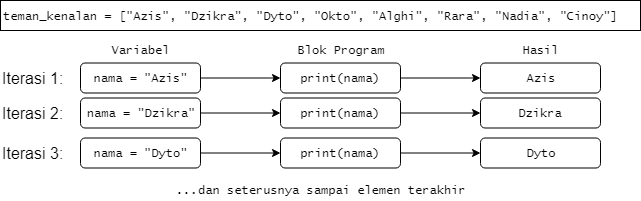
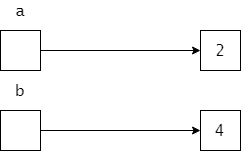
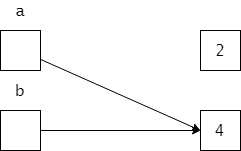
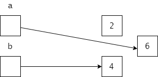
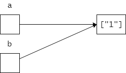
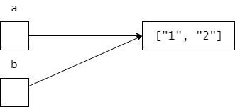
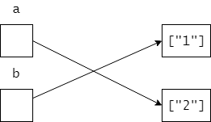

# Struktur Kendali II

**Dasar-Dasar Pemrograman 0** | Penulis: Muhammad Azis Husein, Rafi Muhammad Daffa

## Daftar Isi

3A. Pola Perulangan

3B. Fungsi

3C. Konsep *Mutability* dan *Parameter Passing*

3D. <code>return</code>, <code>break</code>, <code>continue</code>, dan <code>pass</code>

3L. Latihan

## 3A. Pola Perulangan

Secara sederhana, pola perulangan digunakan untuk mengulangi blok program tertentu berdasarkan susunan yang dibuat oleh pemrogram. Dalam Python, pola perulangan ini dapat dikendalikan oleh dua tipe susunan, yaitu urutan data (dengan <code>for</code>) dan kondisi (dengan <code>while</code>).

### Pola Perulangan <code>for</code>

Pada materi Tipe Data, kita telah mengetahui bahwa String merupakan untaian dari karakter-karakter. Dalam Python, karakteristik ini membuat String terkategorikan di bawah suatu kelompok tipe data yang bernama tipe urutan (*sequence types*) yang juga mencakup List dan Tuple. Kelompok tipe data urutan ini memiliki karakteristik di mana setiap data pembangunannya disusun secara terurut dan memiliki nomor indeksnya masing-masing untuk proses pemanggilan. Karakteristik ini dapat dimanfaatkan untuk membangun suatu pola perulangan.

Misalnya, kamu punya daftar teman seangkatan yang sudah kamu ajak kenalan seperti berikut ini:

~~~python
teman_kenalan = ["Azis", "Dzikra", "Dyto", "Okto", "Alghi", "Rara", "Nadia", "Cinoy"]
~~~

Lalu, kamu ingin mencetak masing-masing dari nama tersebut satu per satu sehingga menghasilkan suatu daftar yang terlihat lebih "manusiawi" seperti berikut ini:

~~~python
Azis
Dzikra
Dyto
Okto
Alghi
Rara
Nadia
Cinoy
~~~

Untuk mencapai hasil tersebut, kamu perlu menjalankan fungsi <code>print()</code> **untuk setiap** nama-nama yang telah kamu masukkan ke dalam variabel <code>teman_kenalan</code> tadi. Memang, kamu bisa saja melakukan hal seperti ini:

~~~python
print(teman_kenalan[0])
print(teman_kenalan[1])
print(teman_kenalan[2])
...dst.
~~~

Melelahkan, bukan? Hal seperti ini tidak *scalable* dan akan menjadi buruk dengan jumlah data besar (450 orang misalnya). Di sinilah, pola perulangan akan membantu kalian. Kita sudah mengetahui bahwa fungsi <code>print()</code> harus dijalankan untuk setiap nama-nama yang ada tadi. Dalam Python, karakteristik "untuk setiap" ini diimplementasikan dalam bentuk ekspresi <code>for</code>. Secara umum, ekspresi <code>for</code> berbentuk seperti berikut ini:

~~~
for suatu_variabel in koleksi_data:
	Blok yang akan dijalankan secara berulang
~~~

Penjelasan:

1. Setiap data pembangun yang ada pada <code>koleksi_data</code> akan diberikan ke <code>suatu_variabel</code> secara berurutan.
2. Pada setiap pemberian data tersebut, blok program yang berada di bawah <code>for</code> akan dijalankan. Berarti, blok program tersebut akan dijalankan sebanyak kejadian pemberian data tadi.
3. Blok <code>for</code> akan selesai apabila koleksi data telah habis atau ada perintah tersurat untuk berhenti.

Proses pencetakan nama-nama teman kenalan tadi dapat diimplementasikan seperti ini:

~~~python
for nama in teman_kenalan:
	print(nama)
~~~

Sebagaimana dapat diamati dari grafik di atas, setiap iterasi mengubah konten dari variabel <code>nama</code> sesuai dengan posisi dari urutan yang ditempuh. Pada perjalanan iterasi pertama, variabel <code>nama</code> akan menggunakan data pada indeks paling awal (0); pada perjalanan iterasi kedua, variabel <code>nama</code> akan menggunakan data pada indeks setelahnya (1); dan seterusnya.

Cobalah untuk mencari hasil dari program-program di bawah ini:

~~~python
daftar_pemberhentian = ["Gambir", "Cirebon", "Tegal", "Pekalongan", "Semarang Tawang"]
for stasiun in daftar_pemberhentian[::-1]:
	print("Berhenti di Stasiun", stasiun)
~~~

~~~python
angka_satuan = [0,1,2,3,4,5,6,7,8,9]
for angka in angka_satuan:
    if angka%3 == 0:
        print("Wow")
    else:
        print(angka)
~~~

#### Fungsi <code>range()</code>

> Notasi fungsi:
>
> ~~~python
> range(start=0,stop,step=1)
> ~~~
>
> Daftar argumen:
>
> 1. <code>start</code> (Positional): Angka pertama dari deret angka yang diinginkan (*default*-nya 0)
> 2. <code>stop</code> (Positional): Batas dari deret angka yang diinginkan (bersifat eksklusif dan harus ada)
> 3. <code>step</code> (Positional): Longkapan yang ingin dilakukan pada setiap angka (*default*-nya 1, tidak melongkap).

Pola perulangan <code>for</code> dapat digunakan untuk sekelompok data dengan tipe data apapun, termasuk angka. Ada beberapa kasus di mana kita ingin melakukan perulangan dengan angka seperti untuk:

1. Mengulangi suatu blok program sebanyak x kali (2 kali, 8 kali, 10 kali, 12 kali, dst.)
2. Mencetak angka-angka ganjil atau genap
3. Dan lain-lain

Untuk kasus-kasus ini, kamu tidak perlu membuat urutan angka sendiri dalam bentuk List. Kamu dapat menggunakan fungsi <code>range()</code> untuk membuatkan urutannya untukmu. Sederhananya, fungsi ini mirip dengan *slicing* di mana kita melakukan pemotongan terhadap suatu deret angka yang tak berhingga. Umumnya, fungsi ini ditempelkan langsung ke <code>for</code> seperti berikut ini:

~~~python
for i in range(4):
	print("We are in Iteration",i+1)
~~~

Hasilnya adalah:

~~~
We are in Iteration 1
We are in Iteration 2
We are in Iteration 3
We are in Iteration 4
~~~

Penjelasan:

1. Fungsi <code>range()</code> akan membuat urutan sesuai dengan permintaan, yakni 0, 1, 2, dan 3.
2. Terjadi perubahan nilai variabel <code>i</code> sebanyak 4 kali di mana pada setiap perubahan tersebut, nilai <code>i+1</code> dicetak bersama dengan String "We are in Iteration".

Perlu diketahui bahwa fungsi ini menghasilkan urutan dengan tipe data tersendiri dengan nama yang sama. Apabila kamu ingin menggunakannya di tempat selain <code>for</code>, disarankan menggunakan *casting* ke List atau Tuple.

Cobalah untuk mencari hasil dari program-program berikut ini:

~~~python
for i in range(10):
    print(i%3)
~~~

~~~python
for i in range(1, 13):
	if i+1 == 6:
		print("Menuju 6")
	else:
		print(i)
~~~

~~~python
for i in range(10):
	print("Lol\nLol")
~~~

~~~python
for i in range(2,10,3):
	print(i)
~~~

~~~python
for i in range(0):
	print("Foo")
~~~

### Pola Perulangan <code>while</code>

Kali ini, tinjauan akan kita alihkan menuju Boolean dan operasi-operasi yang dapat dilakukan olehnya. Pada materi Struktur Kendali I, kamu telah mengetahui bahwa kondisi yang didefinisikan pada <code>if</code> akan menentukan apakah program akan masuk ke dalam blok tersebut atau tidak. Sebagai pengingat, coba amati program berikut ini:

~~~python
angka = 1
if angka <= 10:
	print(angka)
~~~

Karena variabel <code>angka</code> berisi nilai Integer 1 dan kondisi yang didefinisikan adalah <code>angka</code> kurang dari/sama dengan 10, maka angka tersebut akan dicetak ke layar. Berarti, kondisi True yang dihasilkan oleh operasi pembanding yang kita lakukan akan menjalankan kondisi yang didefinisikan. Lalu, bagaimana jika kita ingin mencetak **semua** angka yang kurang dari/sama dengan 10 seperti berikut ini?

~~~
1
2
3
4
5
6
7
8
9
10
~~~

Sebelumnya, kamu telah memiliki variabel <code>angka</code> yang berisi nilai Integer 1. Untuk melakukan pencetakan terhadap nilai seperti diminta, berarti kamu dapat mencetak isi dari variabel tersebut kemudian menambahkannya **selama** isi dari variabel tersebut masih kurang dari/sama dengan 10. Dalam Python, pola perulangan seperti ini diimplementasikan dalam bentuk perulangan <code>while</code> yang memiliki bentuk:

~~~python
while sebuah_kondisi:
	Blok yang dijalankan selama kondisi terpenuhi (True)
~~~

Untuk masalah pencetakan angka tadi, program Python yang dapat menyelesaikannya adalah sebagai berikut:

~~~python
angka = 1
while angka <= 10:
	print(angka)
    angka += 1
~~~

Penjelasan:

1. Pada kondisi awal, variabel <code>angka</code> berisi nilai Integer 1. Kondisi ini memenuhi persyaratan awal untuk masuk ke dalam blok <code>while</code>.
2. Blok <code>while</code> akan dijalankan dengan nilai variabel <code>angka</code> 1 yang akan mencetak nilai tersebut kemudian memodifikasi variabelnya untuk menampung <code>angka</code>+1 (2).
3. Python akan kembali mengecek kondisi tadi secara terus menerus dan akan menjalankannya apabila masih memenuhi.
4. Ketika kondisi tersebut sudah dilanggar, maka blok <code>while</code> selesai dijalankan.

#### Pola Perulangan Tak Berhingga

> Pola seperti ini kadang berguna untuk beberapa kasus. Namun, tetap perlu ada batasan terhadap jumlah perulangan yang dilakukan blok tersebut.

Karena blok program yang ada di bawah <code>while</code> akan dijalankan **selama** kondisi yang diberikan bernilai True, kamu harus menyusun cara agar kondisi yang diberikan tersebut dapat diubah menjadi False sehingga blok dapat dihentikan. Apabila kondisi tersebut tidak dapat berubah menjadi False pada waktu tertentu, akan tercipta pola perulangan tak berhingga. Amatilah program berikut ini:

~~~python
angka = 1
while angka <= 10:
	print(angka)
~~~

Program ini mirip dengan yang sebelumnya. Bedanya, pada setiap perulangan yang dilakukan, variabel <code>angka</code> tidak mengalami perubahan. Amatilah hasil program di atas di Python-mu!

> Untuk menghentikan program Python yang sedang berjalan secara paksa, gunakan <code>Ctrl</code> + <code>C</code>.

Pada proses pemrograman, blok program <code>while</code> harus disusun bersamaan dengan asuransi bahwa program tersebut akan berhenti normal pada waktu tertentu.

Cobalah untuk mencari hasil dari program-program di bawah ini:

~~~python
num = 0
while (num <= 5):
   print(num, end=" ")
   num += 1
~~~

~~~python
menit = 0
sinyal = "Merah"
while sinyal == "Merah":
	if menit == 5:
		sinyal = "Hijau"
		print("Diizinkan berangkat")
	else:
		print("Berhenti")
		menit += 1
~~~

~~~python
daftar_daya = [100, 150, 300, 120, 210, 800, 140, 1500, 240, 850, 160]
pemakaian = 0
indeks = 0
while pemakaian + daftar_daya[indeks] <= 3500:
	pemakaian += daftar_daya[indeks]
	indeks += 1
	print("Pemakaian saat ini: ", pemakaian)
~~~

### Penggunaan <code>else</code> dalam Pola Perulangan

Pola perulangan juga dapat diikuti oleh pernyataan <code>else</code> yang memiliki blok program di bawahnya. Program akan memasuki blok <code>else</code> apabila pola perulangan berjalan secara normal (tidak diberhentikan secara paksa). Kondisi yang menyebabkan masuknya <code>else</code> adalah:

1. Untuk <code>for</code>, urutan datanya sudah habis terpakai.
2. Untuk <code>while</code>, kondisinya sudah tidak memenuhi syarat.

Struktur pola perulangan yang mengandung <code>else</code> adalah sebagai berikut:

~~~python
for i in koleksi_data:
    # Blok program untuk setiap iterasi
else:
    # Blok program yang jalan ketika for selesai tanpa pemberhentian paksa
~~~

~~~python
while suatu_kondisi:
    # Blok program untuk setiap iterasi
else:
    # Blok program yang jalan ketika while selesai tanpa pemberhentian paksa
~~~

Contoh:

~~~python
def cari_dyto(list_nama):
    for nama in list_nama:
        if nama == "Dyto":
            return True
    else:
        return False
daftar = ["Azis", "Dzikra", "Yoga", "Cinoy", "Ray", "Ali", "Meldi"]
print(cari_dyto(daftar))
~~~

Hasil:

~~~
False
~~~

Penjelasan:

1. Pemanggilan fungsi <code>cari_dyto</code> akan menjalankan sebuah iterasi yang mengecek satu per satu elemen dari List apakah sama dengan Dyto atau tidak.
2. Karena tidak ada yang sama dengan Dyto, maka kata kunci <code>return</code> tidak akan dijalankan sehingga <code>for</code> berhenti sempurna dengan habisnya koleksi data.
3. Karena <code>for</code> berhenti sempurna, blok <code>else</code> dijalankan dengan mengembalikan False ke pemanggilnya.

### Pola Perulangan Bersarang

Dalam membuat pola perulangan, mungkin saja bahwa pola perulangan tersebut menjalankan suatu pola perulangan lain di dalamnya. Pola perulangan seperti ini disebut pola perulangan bersarang (*nested loop*). Sebagai contoh, mari kita ambil contoh program yang memeragakan cara kerja jam.

> **00:00:00**

Kita mengetahui bahwa bagian detik dari jam tersebut akan berubah 1x setiap detiknya. Kemudian, saat detik tersebut selesai melakukan iterasi (dari 59 kembali ke 00), bagian menitnya turut bertambah 1. Begitu pula dengan bagian jamnya, di mana saat bagian menitnya selesai melakukan iterasi (dari 59 kembali ke 00), bagian jamnya turut bertambah 1. Apabila masing-masing dari bagian jam, menit, dan detik tersebut dijadikan sebuah variabel, maka perubahan yang terjadi adalah sebagai berikut:

| Jam   | 00   |      |      |      |      |      |      |      |      |      |      |      | 01   |
| ----- | ---- | ---- | ---- | ---- | ---- | ---- | ---- | ---- | ---- | ---- | ---- | ---- | ---- |
| Menit | 00   |      |      |      |      | 01   |      |      |      |      | ...  | ...  | 00   |
| Detik | 00   | 01   | ...  | 58   | 59   | 00   | 01   | ...  | 58   | 59   | ...  | ...  | 00   |

Dalam Python, struktur seperti ini dapat diimplementasikan dengan tiga tingkatan pola perulangan <code>for</code> sebagai berikut:

~~~python
for jam in range(24):
	for menit in range(60):
		for detik in range(60):
			print(jam,":",menit,":",detik,":")
~~~

Penjelasan:

1. Anggaplah setiap blok <code>for</code> yang ada sebagai blok program tersendiri. Sehingga, ada blok jam, menit, dan detik.
2. Dengan <code>range</code> 24, berarti blok jam akan dijalankan sebanyak 24 kali yang masing-masing akan memanggil blok menit.
3. Dengan <code>range</code> 60, berarti blok menit akan dijalankan sebanyak 60 kali yang masing-masing akan memanggil blok detik.
4. Dengan <code>range</code> 60, berarti blok detik akan dijalankan sebanyak 60 kali yang masing-masing akan memanggil fungsi <code>print</code>.
5. Suatu pola perulangan baru bisa melanjutkan perulangannya setelah blok di dalamnya selesai dilakukan. Berarti, blok menit baru akan melanjutkan ke perulangan selanjutnya setelah blok detik telah berjalan sebanyak 60 kali. Begitupun dengan jam.

Hasil:

~~~
0 : 0 : 0
.....
0 : 0 : 59
0 : 1 : 0
0 : 1 : 1
.....
0 : 59 : 59
1 : 0 : 0
1 : 0 : 1
.....
23 : 59 : 59
~~~

Kamu juga dapat mengamati proses pola perulangan bersarang pada sistem *rotor* yang merupakan salah satu metode enkripsi dalam sistem Enigma yang pernah digunakan di Perang Dunia ke-2. Situs peraga [ini](http://enigmaco.de/enigma/enigma.html) dapat membantumu dalam mengamatinya. Pada sistem tersebut, setiap kali tombol *keyboard* ditekan, *rotor* paling kanan akan melangkah sejauh 1 langkah. Ketika *rotor* paling kanan tersebut telah berputar kembali ke awal, pergantian kembali ke awal juga akan menarik *rotor* di sebelah kirinya untuk melangkah sejauh 1 langkah. Cara kerja ini mirip dengan jam tadi.

## 3B. Fungsi

Pada subbab 2A, kamu telah mempelajari cara untuk mengulangi suatu blok program baik melalui iterasi urutan data maupun dengan kondisi Boolean. Namun, perulangan blok program terjadi langsung sesuai dengan definisi yang dibuat. Contohnya:

~~~python
for i in range(5):
	print(i)
~~~

Berarti, pencetakan nilai variabel <code>i</code> akan dilakukan sebanyak 5 kali dengan nilai <code>i</code> berupa Integer 0, 1, 2, 3, dan 4. Pencetakan nilai variabel tersebut akan dilakukan oleh Python secara langsung dan berurutan dari awal sampai akhir. Lalu, apa yang harus dilakukan apabila kita menginginkan program tersebut berulang di beberapa tempat berbeda? Ya, sebenarnya kamu bisa saja menyalin blok tersebut ke tempat yang diinginkan. Namun, kamu sebenarnya bisa menggunakan fungsi.

Dalam pemrograman, fungsi adalah suatu blok program yang memiliki sebuah *signature* (terdiri atas nama fungsi beserta argumen-argumennya) dan dapat dipanggil berulang-ulang oleh program melalui *signature* tersebut. Selama ini, kita sebenarnya sudah menggunakan banyak fungsi, seperti <code>print()</code>, <code>eval()</code>, dan <code>abs()</code>. Fungsi sering digunakan untuk mempermudah pemrograman karena dapat dipakai berulang-ulang di tempat berbeda (*reusable*) dan pengguna fungsi tersebut tidak perlu mengetahui apa yang terjadi di balik fungsi tersebut dan hanya mengetahui *signature* dari program tersebut beserta tujuannya (*encapsulation*). Contohnya, ketika kamu menggunakan fungsi <code>print()</code>, kamu hanya mengetahui cara memanggil fungsi tersebut dan keluaran yang dihasilkan. Kamu tidak perlu mengetahui apa yang dilakukan oleh fungsi tersebut untuk mencetak hasil yang kamu inginkan.

Selain menggunakan fungsi yang disediakan oleh Python, kamu dapat mendefinisikan sendiri fungsi-fungsi yang kamu inginkan dalam program kamu. Secara umum, fungsi dalam Python dapat didefinisikan dengan cara berikut:

~~~python
def nama_fungsi(argumen1, argumen2, ...., argumenN):
	Blok program yang akan jalan ketika fungsi dipanggil
~~~

Dalam matematika, kamu mungkin telah mengenal fungsi-fungsi seperti <code>f(x)</code> dan <code>g(x)</code>. Misalnya, kita mendefinisikan sebuah fungsi <code>f(x)</code> = 2x + 1. Setiap nilai x yang kamu berikan, misalnya 8 atau 10, akan menghasilkan nilai yang berbeda (17 dan 21). Fungsi tersebut dapat kamu definisikan dengan program berikut ini:

~~~python
def f(x):
	print(2*x+1)
~~~

Kamu mungkin menyadari bahwa kata kunci yang digunakan adalah <code>def</code>, singkatan dari "*define*". Artinya, kamu baru melakukan definisi dari fungsi tersebut. Fungsi tersebut tidak akan dijalankan sampai kamu memanggilnya menggunakan *signature* yang dibuat (nama fungsi dan argumennya). Misalnya:

~~~python
f(8)
f(10)
~~~

Hasilnya adalah:

~~~
17
21
~~~

Penjelasan:

1. Ketika kamu memanggil fungsi <code>f(8)</code>, artinya kamu memanggil fungsi <code>f</code> tadi dengan argumen 8. Nilai 8 tersebut akan diberikan ke variabel x sesuai definisi dan dapat digunakan dalam fungsi tersebut.
2. Fungsi <code>print()</code> yang ada di dalam definisi fungsi tadi dijalankan dengan x bernilai 8.
3. Ketika kamu memanggil fungsi <code>f(10)</code>, kamu memanggil fungsi <code>f</code> tadi, kali ini dengan nilai x berupa Integer 10. Fungsi <code>print()</code> akan dijalankan dengan nilai 10 tersebut.

#### <code>print()</code> vs <code>return</code>

Cobalah untuk menjalankan program di bawah ini:

~~~python
def f(x):
    print(x**2)

y = f(3) + 2
print(y)
~~~

Apa hasilnya? Apakah sesuai dengan ekspektasi kamu? Kamu akan disambut dengan *error* berikut ini ketika kamu berusaha menghitung hasil dari y:

~~~
TypeError: unsupported operand type(s) for +: 'NoneType' and 'int'
~~~

Loh, kok NoneType? Bukannya seharusnya Integer ya? Nah, di sinilah kamu harus mulai berkenalan dengan kata kunci <code>return</code> dan bedanya dengan fungsi <code>print()</code>. Fungsi <code>print()</code> hanya bertujuan untuk mencetak sesuatu ke layar. Fungsi seperti ini disebut fungsi *void*, yaitu fungsi yang tidak mengembalikan apapun kepada pemanggilnya. Sehingga, ketika kamu memanggil <code>f(3)</code> + 2, Python akan mencetak hasil pemangkatannya ke layar (9) namun operasi penjumlahan tersebut tidak mendapatkan apapun (None). Di sisi lain, kata kunci <code>return</code> akan memerintahkan Python untuk mengembalikan nilai yang diinginkan kepada pemanggilnya. Contohnya:

~~~python
def f(x):
    return x**2

y = f(3) + 2
print(y)
~~~

Kali ini, hasil dari pemangkatannya tidak dimunculkan ke layar. Namun, hasil dari y dapat dicetak ke layar:

~~~
11
~~~

Penjelasan:

1. Operasi matematika <code>f(3)</code> + 2 akan dievaluasi oleh Python di mana Python akan memanggil <code>f(3)</code> dengan harapan mendapatkan suatu nilai untuk dijumlahkan.
2. Fungsi <code>f(3)</code> akan mengembalikan nilai kuadrat dari 3 (9) ke pemanggilnya, yaitu operasi matematika tadi.
3. Operasi matematika tadi akan menghasilkan 11 dan menyimpannya di variabel y.

Perlu diketahui bahwa ketika <code>return</code> dijalankan, semua kode di dalam blok fungsi tersebut yang belum dijalankan (berada di bawah <code>return</code>) tidak akan dijalankan.

#### Argumen Fungsi

Dalam pemrograman, sebuah fungsi dapat memiliki argumen atau tidak memiliki argumen. Contohnya:

~~~python
def alarm():
	print("Woy bangun, udah siang!")

alarm()
~~~

Pada program di atas, perilaku dari fungsi <code>alarm</code> tidak mengalami perubahan apapun sehingga semua pemanggilan fungsi <code>alarm()</code> akan menghasilkan keluaran yang sama.

Mari kita ambil sebuah contoh fungsi di bawah ini:

~~~python
def power(x,y):
	return x**y
~~~

Ada dua cara untuk menggunakan argumen dalam sebuah fungsi Python:

1. *Positional Argument*: Pemberian argumen dilakukan berdasarkan posisinya.

   Contoh:

   ~~~
   power(2,3)
   ~~~

   Sehingga, nilai x nanti adalah 2 dan nilai y adalah 3.

2. *Keyword Argument*: Pemberian argumen dilakukan berdasarkan variabel yang didefinisikan.

   Contoh:

   ~~~
   power(y=2,x=3)
   ~~~

   Sehingga, meskipun posisinya terbalik, nilai x tetap 3 dan nilai y tetap 2.

Pada umumnya, kamu dapat menggunakan dua cara ini secara bersamaan. Namun, ada beberapa kasus di mana kamu hanya dapat menggunakan salah satunya. Salah satunya adalah penggunaan *infinite positional argument* seperti berikut ini:

~~~python
def print_grosiran(*item,pemisah="\n"):
    print(item)
	for i in item:
		print(item,end=pemisah)
~~~

Pada fungsi ini, <code>item</code> merupakan *infinite positional argument* yang mengumpulkan **semua** argumen posisional yang diberikan menjadi sebuah Tuple. Karena setelahnya ada argumen <code>pemisah</code>, maka argumen tersebut harus berbentuk *keyword* karena tidak akan ada sisa argumen setelah dikumpulkan oleh *item* tadi.

Untuk membuat sebuah *infinite positional argument*, beberapa hal ini harus diperhatikan:

1. Argumen ditandai dengan karakter ‘*’ sebelum deklarasi nama argumennya.
2. Dalam satu fungsi, hanya satu argumen boleh berbentuk *infinite positional argument*.
3. Tidak boleh ada *positional argument* setelahnya.
4. Tidak boleh menggunakan *keyword argument*.

#### Nilai *Default*

Untuk menggunakan *infinite positional argument* dengan argumen lainnya di belakangnya, *keyword argument* tersebut harus memiliki nilai *default* sehingga dapat digunakan apabila argumen tidak tersedia. Hal ini sebenarnya berlaku untuk semua tipe argumen di mana ada sebuah nilai *default* yang dapat digunakan sewaktu-sewaktu tidak diberikan. Contohnya:

~~~python
def power(x,y=1):
	return x**y
~~~

Coba kamu panggil fungsi tersebut seperti berikut ini:

~~~python
print(power(2,4))
print(power(2))
print(power(x=1,y=2))
print(power(x=2))
~~~

Pada pemanggilan kedua dan keempat, meskipun kita hanya memberikan 1 argumen untuk diberikan kepada x, nilai y tetap akan terdefinisi karena memiliki nilai *default* 1.

Coba cari hasil dari program-program di bawah ini:

~~~python
def volume(panjang, lebar = 5, tinggi = 7):
   return panjang * lebar * tinggi
w = volume(10)
x = volume(5, 2)
y = volume(2, 3, 4)
z = volume(panjang = 3, tinggi = 10)
print(w)
print(x)
print(y)
print(z)
~~~

~~~python
def fungsi(satu, *banyak):
   print("Satu:", satu)
   print("Banyak:", banyak)
fungsi(1, 2, 3, 4)
fungsi(5)
fungsi(satu = 6)
fungsi(satu = 7, banyak = (8, 9, 10))
~~~

~~~python
def cetak():
   print("Halo Peserta DDP 0")
   print("Rajinlah belajar agar kamu bertambah pintar")
cetak()
~~~

## 3C. Konsep *Mutability* dan *Parameter Passing*

### *Mutability*

Dalam Python, setiap tipe data diperlakukan sama dalam hal penyimpanan apabila diberikan ke suatu variabel. Data akan disimpan pada suatu blok memori terpisah dari variabelnya dan variabel hanya akan menyimpan sebuah alamat ke blok memori di mana data tersebut disimpan. Hal ini berbeda dengan bahasa pemrograman lain, seperti Java, di mana tipe data tertentu disimpan di blok memori yang sama dengan variabelnya.

Sebagai contoh, anggaplah ada dua variabel <code>a</code> dan <code>b</code> seperti berikut:

~~~python
a = 2
b = 4
~~~

Variabel <code>a</code> dan <code>b</code> masing-masing hanya menyimpan alamat dari blok memori yang menampung data angka yang dibuat. Pada grafik di atas, alamat direpresentasikan dengan tanda panah yang menunjuk ke blok memori yang dimaksud. Lalu, misalnya kita ingin membuat nilai <code>a</code> menjadi sama dengan nilai <code>b</code> sebagai berikut:

~~~
a = b
~~~

Yang terjadi adalah alamat yang disimpan oleh <code>a</code> akan diubah menjadi alamat yang disimpan oleh <code>b</code> sehingga akan menunjuk ke objek angka yang sama.

Namun, sebagai kompromi terhadap tidak adanya perbedaan konsep penyimpanan data dalam Python, Python menganut sistem *mutability*. Sistem ini menentukan apakah suatu objek bisa diubah di tempat atau tidak. Tipe-tipe data yang ada di Python terbagi menjadi dua jenis berdasarkan sifat *mutability*-nya:

1. *Immutable*: Tipe data yang tidak dapat diubah di tempat, sehingga perubahan yang dikenakan padanya akan menghasilkan objek baru dan data aslinya tidak berubah. Contoh: Integer, Float, Tuple, String.
2. *Mutable*: Tipe data yang dapat diubah di tempat, sehingga perubahan **tertentu** yang dikenakan padanya akan mengubah objek itu sendiri. Contoh: List.

Misalnya, variabel <code>a</code> dan <code>b</code> tadi menunjuk ke objek Integer 4 yang sama. Kemudian, kita mengubah <code>a</code> dengan operasi matematika sebagai berikut:

~~~python
a += 2
~~~

Meskipun <code>a</code> dan <code>b</code> menunjuk ke objek yang sama, karena Integer bersifat *immutable*, yang terjadi adalah akan terbentuk objek baru yang merupakan hasil dari penjumlahan nilai a sebelumnya (2) dengan 2:

Pada grafik di atas, terlihat bahwa nilai <code>b</code> tidak akan berubah meskipun objek yang ditunjuk pada awalnya sama. Lain halnya dengan perubahan yang dikenakan pada tipe data *mutable*:

~~~python
a = ["1"]
b = a
a.append("2")
~~~

Sebelum dikenakan <code>append</code>:

Setelah dikenakan <code>append</code>:

Untuk tipe data *mutable*, perubahan yang dikenakan tidak akan membuat objek baru, namun akan mengubah objeknya itu sendiri. Sehingga, meskipun kita memodifikasi variabel <code>a</code> saja, variabel <code>b</code> juga turut berubah.

Namun, apabila kita memberikan suatu objek baru ke suatu variabel, keterkaitan antar-variabelnya akan terputus meskipun tipe datanya *mutable*, misalnya:

~~~python
a = ["1"]
b = a
a = ["2"]
~~~

Sebelum diberikan objek baru:

Setelah diberikan objek baru:

### *Parameter Passing*

Pada setiap pemanggilan fungsi yang berkaitan dengan argumen-argumen, konsep *mutability* tetap berlaku. Amatilah contoh di bawah ini:

~~~python
def sebuah_fungsi(argumen):
	print("argumen =",argumen)
random_string = "Foo"
sebuah_fungsi(random_string)
~~~

Hasil:

~~~
argumen = Foo
~~~

Dengan menjadikan <code>random_string</code> sebagai argumen <code>sebuah_fungsi</code>, maka yang terjadi adalah variabel <code>argumen</code> akan diberikan alamat dari blok memori yang disimpan oleh <code>random_string</code>, dalam hal ini adalah objek String "Foo". Perlu dicatat bahwa variabel yang merupakan bagian dari sebuah fungsi, baik yang dijadikan argumen maupun variabel-variabel yang dibuat di dalam fungsi, hanya hidup di dalam fungsi. Sehingga, variabel-variabel tersebut tidak dapat dipanggil dari luar fungsi. Contoh:

~~~python
def a_function(argumen):
    an_item = argumen
a_function("WOW")
print(argumen)
print(an_item)
~~~

Hasil:

~~~
NameError: name 'argumen' is not defined
~~~

> **Further Learning**:
>
> Konsep variabel dalam fungsi ini merupakan bagian dari pembahasan *namespace* yang merupakan materi Dasar-Dasar Pemrograman 1 dengan nama bab yang sama (*Namespaces*).

Dengan menerapkan konsep *mutability* dalam *parameter passing*, jika data tersebut bersifat *immutable*, maka perubahannya tidak akan sampai ke luar fungsi. Contoh:

~~~python
def modify_number(num):
	num += 3
    print("num =",num)
my_num = 5
modify_number(my_num)
print("my_num =",my_num)
~~~

Hasil:

~~~
num = 8
my_num = 5
~~~

Sebaliknya, jika data bersifat *mutable*, maka perubahan akan dikenakan baik di dalam maupun di luar fungsi. Contoh:

~~~python
def modify_list(lst):
	lst.append("3")
    print("lst =",lst)
my_lst = ["1"]
modify_list(my_lst)
print("my_lst =",my_lst)
~~~

Hasil:

~~~
lst = ['1', '3']
my_lst = ['1', '3']
~~~

## 3D. <code>return</code>, <code>break</code>, <code>continue</code>, dan <code>pass</code>

### <code>return</code>

Kata kunci <code>return</code> digunakan dalam sebuah fungsi untuk mengembalikan suatu nilai kepada pemanggil fungsi tersebut. Kata kunci ini juga akan memberhentikan jalannya sebuah fungsi. Sehingga, apabila masih terdapat blok program di bawah <code>return</code> di dalam fungsi tersebut, maka blok program tersebut tidak akan jalan. Contohnya:

~~~python
def angka_positif(angka):
    if angka > 0:
        return True
    print("Angka bukan positif, ulangi pemanggilan fungsi")
print(angka_positif(2))
angka_positif(-1)
~~~

Pada pemanggilan fungsi <code>angka_positif(2)</code>, fungsi akan mengembalikan nilai Boolean True kepada pemanggilnya, yaitu fungsi <code>print()</code>. Sehingga, akan dicetak nilai yang dikembalikan tadi, yakni True. Fungsi <code>print("Angka bukan positif, ulangi pemanggilan fungsi")</code> tidak dijalankan oleh pemanggilan fungsi <code>angka_positif(2)</code> karena terletak setelah <code>return</code>. Di sisi lain, pemanggilan fungsi <code>angka_positif(-1)</code> akan menjalankan fungsi <code>print("Angka bukan positif, ulangi pemanggilan fungsi")</code> karena blok <code>if</code> yang mengandung <code>return</code> tidak memenuhi syarat, sehingga fungsi berjalan terus sampai selesai.

### <code>break</code>

Kata kunci <code>break</code> digunakan untuk menghentikan suatu pola perulangan yang sedang berjalan. Dengan adanya <code>break</code>, semua blok setelahnya (termasuk perulangan selanjutnya) tidak akan dilaksanakan. Contoh:

~~~python
for i in range(5):
   if(i == 3):
      break
   print(i)
print("program selesai")
~~~

Hasil:

~~~
0
1
2
program selesai
~~~

Penjelasan:

1. Pada saat nilai <code>i</code> 0, 1, dan 2, kondisi <code>if</code> tidak memenuhi syarat sehingga <code>break</code> tidak dijalankan. Iterasi berlanjut.
2. Saat bertemu dengan nilai <code>i</code> 3, kondisi <code>if</code> memenuhi syarat dan akan bertemu dengan <code>break</code>. Hal ini akan menyebabkan pola perulangan berhenti tanpa sempat mencetak nilai 3.
3. Program berlanjut dengan mencetak "program selesai".

### <code>continue</code>

Kata kunci <code>continue</code> digunakan untuk memaksa Python untuk berpindah ke perulangan selanjutnya. Dengan adanya <code>continue</code>, semua blok setelahnya **pada perulangan tersebut** tidak akan dijalankan. Program akan segera melanjutkan ke tahapan iterasi selanjutnya. Contoh:

~~~python
word = "FASILKOM UI"
for i in word:
   if(i == "I"):
      continue
   print(i, end=" ")
~~~

Hasil:

~~~
FASLKOM U
~~~

### <code>pass</code>

Kata kunci <code>pass</code> berfungsi sebagai kode kosong di mana kata kunci ini tidak melakukan apa-apa. Kata kunci ini umumnya digunakan sebagai kode *dummy* untuk sebuah kelas atau fungsi yang belum diimplementasikan. Hal ini berguna karena ketika kamu sudah mengetikkan <code>def</code> sebuah fungsi dan argumennya, kamu harus melanjutkan definisinya sampai minimal terdapat satu baris program di dalamnya. Karena <code>pass</code> juga merupakan kode yang tidak melakukan apa-apa, kamu sudah memenuhi syarat untuk membuat sebuah fungsi meskipun tidak melakukan apa-apa. Coba bandingkan perjalanan kedua program ini:

~~~python
def function_to_be_defined_later():
~~~

~~~python
def function_to_be_defined_later():
	pass
~~~

Program pertama akan menghasilkan *error* karena fungsi yang sudah dideklarasikan harus memiliki setidaknya satu baris program. Sebaliknya, program kedua akan berjalan baik-baik saja.

