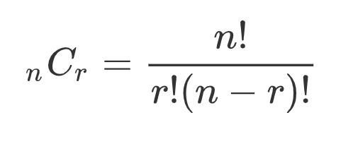

# Pengenalan Pengecualian

**Dasar-Dasar Pemrograman 0** | Penulis: Rafi Muhammad Daffa

## Daftar Isi

4A. Kesalahan Umum dalam Pemrograman

4B. Dokumentasi Program

4C. *The Zen of Python* (PEP 20)

4L. Latihan (Bergabung dengan 3L)

## 4A. Kesalahan Umum dalam Pemrograman

Dalam membuat sebuah program, kenyataan pahit yang terjadi adalah tidak ada program yang sempurna. Bahkan, program yang sudah didesain sedemikian rupa oleh tim yang besar masih mungkin mengalami kesalahan. Kesalahan tersebut dapat terjadi karena berbagai macam hal, misalnya:

1. Kalkulasi aritmatis yang meleset (presedensi, asosiasi, dan lain-lain).
2. Masukan pengguna yang tidak sesuai dengan rancangan program.
3. *Typing error (Typo)*.
4. Dan-lain-lain.

Oleh karena itu, kita sebagai perancang program harus mampu mengidentifikasi kesalahan-kesalahan umum dalam pemrograman dan solusi yang dapat ditempuh untuk mencegah kesalahan tersebut terjadi.

Secara umum, ada tiga macam kesalahan dalam pemrograman, yaitu *syntax error*, *runtime error*, dan *logic error*.

### *Syntax Error*

Kesalahan sintaks mencakup segala kesalahan yang berkaitan dengan "kesastraan" Python. Kesalahan ini dapat mencakup namun tidak terbatas pada penggunaan tanda baca, indentasi, dan kesalahan ketik. Kesalahan ini merupakan kesalahan yang paling pertama ditangkap oleh Python dan akan mencegah program tersebut untuk dijalankan sama sekali. Contohnya:

~~~python
dev fungsi(arg1,arg2):
    print(arg1)

def fungsi2(arg3,arg4)
	print(arg3)
    
def fungsi3(arg5,arg6):
print(arg5)
~~~

Salah satu komponen dari *interpreter* Python yang dinamakan *parser* akan mengecek program yang dibuat dari atas sampai bawah. Jika ditemukan kesalahan sintaks, Python akan secara otomatis menangkapnya dan akan dipresentasikan di IDLE dengan arsiran merah atau akan dicetak di Console untuk yang lainnya.

### *Runtime Error*

Kesalahan yang masuk dalam kategori ini adalah kesalahan yang terjadi pada saat programnya berjalan. Apabila kesalahan dalam kategori ini terjadi, program akan diberhentikan secara otomatis. Namun, hal ini tidak akan mencegah Python untuk menjalankan program tersebut pada awalnya. Mayoritas *runtime error* memiliki nama pengecualian khusus yang dapat digunakan untuk melakukan analisis kesalahan. Kesalahan yang lazim muncul adalah sebagai berikut:

1. <code>NameError</code>: Umumnya terjadi karena suatu variabel yang belum dideklarasikan digunakan untuk sesuatu.

   ~~~python
   print(a)
   ~~~

2. <code>TypeError</code>: Umumnya terjadi karena terdapat ketidakcocokan antara suatu tipe data dengan operasi yang dikenakan padanya atau ada tabrakan antar-tipe data.

   ~~~python
   "A" ** "3"
   ~~~

3. <code>ZeroDivisionError</code>: Kesalahan aritmatika khusus yang melibatkan pembagian suatu angka dengan nol.

   ~~~python
   1/0
   ~~~

4. <code>OverflowError</code>: Umumnya terjadi karena tipe-tipe data yang memiliki batas kapasitas telah melampaui batasnya.

   ~~~python
   310235.60481380235**121
   ~~~

5. <code>IndexError</code>: Umumnya terjadi ketika indeks suatu data yang dipanggil tidak ada.

   ~~~python
   my_lst = ["Type","Me"]
   my_lst[10000]
   ~~~

6. <code>ValueError</code>: Umumnya terjadi ketika melakukan *type casting* dengan data yang salah.

   ~~~python
   int("4.5")
   int("Z")
   ~~~

Setiap kesalahan dalam tipe ini terjadi, Python akan memberhentikan program tersebut dan akan memberikan laporan terhadap baris kode terakhir yang dijalankan sebelum kesalahan terjadi dan deskripsi singkat dari kesalahan yang terjadi. Laporan ini disebut *traceback* dan disusun seperti ini:

~~~
Traceback (most recent call last):
  File "<pyshell#2>", line 1, in <module>
    310235.60481380235**121
OverflowError: (34, 'Result too large')
~~~

Laporan tersebut terdiri atas beberapa informasi sebagai berikut:

1. <code>File "<pyshell#2>"</code>: Berkas Python di mana kesalahan tersebut terjadi. Jika kesalahan terjadi di komando yang ditulis di Shell, maka File akan menunjukkan <code>pyshell</code>.

2. <code>line 1</code>: Baris program di mana kesalahan tersebut terjadi.

3. <code>in \<module></code>: Jika baris program merupakan bagian dari modul, nama modulnya akan disebutkan di sini.

4. <code>310235.60481380235**121</code>: Blok program yang mengalami kesalahan.

5. <code>OverflowError</code>: Nama dari kesalahan yang terjadi.

6. <code>(34, 'Result too large')</code>: Keterangan dari kesalahan yang terjadi.

   

> ##### <code>KeyboardInterrupt</code>
>
> Jika kamu melakukan interupsi secara paksa program dengan menekan <code>Ctrl</code> + <code>C</code>, maka sebenarnya akan terjadi *runtime error* dengan jenis yang khusus. Pada dasarnya, interupsi yang kamu lakukan melalui *keyboard* merupakan "kesalahan" yang terjadi saat programnya berjalan. Maka, ketika kamu menginterupsi program secara paksa, *traceback* juga akan muncul.

### *Logic Error*

Kesalahan ini merupakan kesalahan yang paling sulit dicari karena Python tidak akan bisa mengetahui bahwa program tersebut memiliki kesalahan dengan jenis ini. Kesalahan ini bergantung pada pengetahuan perancang program dalam alur program yang diharapkan pada awalnya. Mari kita ambil contoh dalam perhitungan kombinasi:

~~~python
factorial(n)/factorial(r)*factorial(n-r)
~~~

Seharusnya, perhitungan <code>factorial(r)*factorial(n-r)</code> berada di tingkatan yang sama (di bawah pembagian) seperti berikut ini:

Karena Python hanya mengetahui bahwa pembagian dan perkalian memiliki presedensi yang sama, maka Python akan mengevaluasi rumus tadi dari kiri kanan sehingga akan dibagi terlebih dahulu kemudian dikali.

## 4B. Dokumentasi Program

Salah satu hal baik yang dapat membantu perancang program dalam membuat program yang baik adalah memberikan dokumentasi yang memadai terhadap program yang dirancang. Dokumentasi ini diimplementasi dalam bentuk catatan/komentar yang diberikan di antara program yang dapat membantu penjelasan dari program tersebut. Lalu, apa manfaat dari dokumentasi program yang memadai?

1. Berperan sebagai catatan bagi diri kamu sebagai perancang program jika sewaktu-waktu kembali ke program tersebut untuk digunakan kembali atau dikembangkan.
2. Berperan sebagai sinkronisasi ilmu dengan sesama perancang program yang dapat membantu ketika masing-masing perancang bertanggung jawab atas satu aspek dari program dan perancang lainnya membutuhkan aspek tersebut.

Ada tiga cara untuk menyusun sebuah komentar:

1. *Inline*: Komentar dapat ditempatkan di seluruh penjuru kode kecuali di kiri (di kanan, di atas, maupun di bawah). Cara menggunakannya adalah menambahkan tanda pagar (<code>#</code>) sebelum menuliskan komentar.

   ~~~python
   fav_course = [] # Implemented as 2-D List
   ~~~

   ~~~python
   # Variable must contain Integer only
   counter = 0
   ~~~

2. *Block*: Komentar ini hanya dapat ditempatkan di atas atau di bawah suatu baris kode. Namun, komentar ini dapat dibuat dengan baris rangkap. Cara menggunakannya adalah menambahkan tiga tanda petik (<code>"""</code>) di awal dan di akhir blok komentar.

   ~~~python
   """
   Author: Rafi Muhammad Daffa
   Date: 8 August 2019
   Version: 0.1alpha1
   """
   startprogram()
   ~~~

3. *Docstring*: Komentar ini merupakan pengembangan khusus dari *block* yang ditempatkan di bawah definisi fungsi. Komentar ini adalah satu-satunya komentar yang akan dianggap oleh Python dan dijadikan sebagai bentuk dokumentasi dari fungsi yang didefinisikan tersebut.

   ~~~python
   def print_if_even(number):
       """
       This program prints a number only if it is even
       """
       if number%2 == 0:
           print(number)
   ~~~

   Karakteristik spesial lain yang dimiliki oleh komentar seperti ini adalah komentar tersebut dapat diakses saat program berjalan dengan menggunakan fungsi <code>help(nama_fungsi)</code>. Contohnya, anggaplah ada sebuah fungsi <code>hitungTHB</code>.

   ~~~python
   help(hitungTHB)
   ~~~

   Hasil yang dicetak adalah:

   ~~~
   Help on function hitungTHB in module __main__:
   
   hitungTHB(berangkat, datang)
       Hitung Harga THB untuk stasiun yang menerima THB
   ~~~

>Penyusunan *docstring* dalam Python diatur dalam *Python Enhancement Proposals* (PEP) 257 yang dapat kamu akses [di sini](https://www.python.org/dev/peps/pep-0257/).

Dalam menyusun sebuah program, idealnya komentar berperan penting dalam menjelaskan sebuah program. Misalnya, ada sebuah konsep yang mendasari pembuatan blok kode yang kemungkinan akan menimbulkan kebingungan di kemudian hari. Kamu dapat "mencatat" hal tersebut dalam bentuk komentar untuk mencegah lupa saat program kamu akan dipakai atau dikembangkan oleh dirimu sendiri dan orang lain.

## 4C. *The Zen of Python* (PEP 20)

*Python Enhancement Proposal* (PEP) nomor 20 memuat 19 kata mutiara yang dibuat oleh Tim Peters, perancang program yang sudah lama berkecimpung di Python, dan didasari oleh arahan-arahan yang dibuat oleh perancang Python, Guido van Rossum. 19 kata mutiara ini mencakup filosofi pemrograman dalam Python maupun pemrograman secara umum yang diharapkan dapat mengarahkan pemrograman yang lebih baik.

> ***Easter Egg***
>
> 19 kata mutiara ini dapat kamu panggil di Shell dengan <code>import this</code>.

19 kata mutiara tersebut adalah sebagai berikut:

~~~
Beautiful is better than ugly.
Explicit is better than implicit.
Simple is better than complex.
Complex is better than complicated.
Flat is better than nested.
Sparse is better than dense.
Readability counts.
Special cases aren't special enough to break the rules.
Although practicality beats purity.
Errors should never pass silently.
Unless explicitly silenced.
In the face of ambiguity, refuse the temptation to guess.
There should be one-- and preferably only one --obvious way to do it.
Although that way may not be obvious at first unless you're Dutch.
Now is better than never.
Although never is often better than *right* now.
If the implementation is hard to explain, it's a bad idea.
If the implementation is easy to explain, it may be a good idea.
Namespaces are one honking great idea -- let's do more of those!
~~~

Di awal pembelajaran pemrograman ini, ada banyak karakteristik yang berusaha dibangun oleh Python untuk membantu kamu dalam memahami dasar-dasar pemrograman baik. Python merupakan bahasa yang sangat mengedepankan keterbacaan, keindahan, dan kepraktisan. Sehingga, rancanglah program yang mengikuti prinsip-prinsip ini.

Selamat datang di dunia pemrograman buat kamu yang baru memasukinya sekarang!