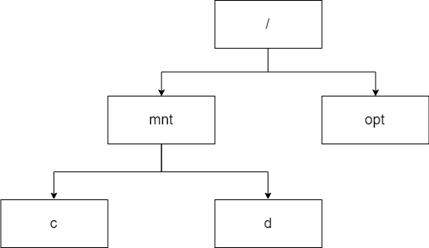

# Materi Pengayaan

**Dasar-Dasar Pemrograman 0** | Penulis: Rafi Muhammad Daffa


## Daftar Isi

P1. Pengelolaan Berkas Teks


## P1. Pengelolaan Berkas Teks

Untuk menunjang jalannya suatu program, kamu akan sering menemukan situasi di mana kamu membutuhkan data yang dapat disimpan secara jangka panjang (tidak hilang setelah kamu menutup program tersebut) dan terpisah dari berkas Python itu sendiri. Situasi-situasi tersebut di antaranya:

1. Penyimpanan akun pengguna untuk kemudahan masuk selanjutnya
2. Penyimpanan data yang dihasilkan oleh program
3. Penggunaan data eksternal (Teks, CSV, JSON, dan lain-lain)

Maka dari itu, mayoritas bahasa pemrograman (termasuk Python) menyediakan metode-metode yang bisa kamu gunakan untuk mengolah berkas teks sebagai penunjang dari program yang kamu susun. Modul ini ditujukan agar kamu dapat mengolah secara sederhana berkas teks untuk menunjang program kamu.

### Pengenalan Sistem Berkas

Saat menggunakan komputer, kamu mungkin sudah kenal dengan berbagai macam tipe berkas, mulai dari berkas teks (.txt) hingga *Scalable Vector Graphics* (.svg). Setiap berkas tersebut memiliki sufiks yang menandakan tipe dari berkas tersebut agar dapat diketahui oleh program yang menggunakannya. Mungkin kamu juga pernah iseng mencoba untuk mengutak-atik sufiks tersebut (misal: .mp3 diganti menjadi .wav) dan salah satu dari tiga kemungkinan berikut ini terjadi:

1. Berkas dapat dibuka secara normal dengan tipe berkas barunya
2. Berkas dapat dibuka namun diinferensikan dengan tipe berkas lamanya
3. Berkas tidak dapat dibuka sama sekali (*corrupt*)

Kemungkinan ini terjadi karena suatu tipe berkas tidak hanya disimpulkan dari sufiks berkasnya, melainkan juga berdasarkan struktur dari berkas itu sendiri. Jika struktur suatu tipe berkas dengan yang lainnya mirip atau didesain untuk dapat ditukar satu sama lain, kemungkinan pertama akan terjadi. Lain halnya apabila strukturnya beda sama sekali atau tidak didesain untuk ditukar, kemungkinan ketiga akan terjadi. Struktur tersebut didapat dari bagaimana berkas tersebut diterjemahkan dari data yang diinginkan menjadi bahasa yang dapat dimengerti dan disimpan oleh komputer. Proses ini disebut *encoding* dan proses kebalikannya dinamakan *decoding*.

Setiap berkas memiliki cara tersendiri untuk direpresentasikan dan digunakan. Cara ini biasanya hanya diketahui oleh suatu program spesifik yang menggunakan program tersebut. Misalnya, berkas MP4 yang di-*encode* dengan H.265 HEVC hanya dapat dibuka oleh program yang mengetahui cara penerjemahan tersebut. Jika kamu mencoba membukanya dengan program yang tidak mendukung (misalnya IDLE atau Notepad), kamu kemungkinan hanya menerima karakter acak tidak bermakna atau bahkan kosong sama sekali.

Sistem *encoding* dan *decoding* ini juga diterapkan dalam teks. Pada materi Pekan 01 (Pengenalan, Tipe Data, dan Variabel), kamu telah dikenalkan dengan sistem ASCII dan Unicode di mana setiap karakter teks dapat direpresentasikan dengan suatu angka. Karena suatu data dalam komputer pada dasarnya hanya 0 dan 1 (biner), maka representasi angka tersebut (diubah menjadi biner terlebih dahulu) adalah cara komputer menyimpan karakter yang kita buat. Contohnya:

~~~python
"CS UI"
~~~

Dengan menggunakan sistem UTF-8, maka komputer akan menerima data seperti berikut ini untuk merepresentasikan String di atas:

~~~
0100001101010011001000000101010101001001
~~~

Agar lebih jelas pembagiannya, amati susunan berikut ini:

~~~
01000011 | 01010011 | 00100000 | 01010101 | 01001001
~~~

Penjelasan:

1. <code>01000011</code> dalam biner jika dikonversikan ke desimal (angka berbasis 10) menjadi 67. 67 merupakan representasi angka dari "C".
2. <code>01010011</code> dalam biner jika dikonversikan ke desimal menjadi 83. 83 merupakan representasi angka dari "S".
3. <code>00100000</code> dalam biner jika dikonversikan ke desimal menjadi 32. 32 merupakan representasi angka dari " " (spasi).
4. <code>01010101</code> dalam biner jika dikonversikan ke desimal menjadi 85. 85 merupakan representasi angka dari "U".
5. <code>01001001</code> dalam biner jika dikonversikan ke desimal menjadi 73. 73 merupakan representasi angka dari "I".

Sama seperti pada tipe berkas, sistem *encoding* dan *decoding* teks ini juga akan memiliki implementasi yang berbeda. Untuk memudahkan, mayoritas program menggunakan sistem UTF-8 dan turunannya apabila dibutuhkan, seperti UTF-16 yang mencakup lebih banyak karakter. Dengan menggunakan sistem yang tepat, maka program kamu akan membaca teks yang dibuat bukan hanya sebagai untaian 0 dan 1 namun sebagai suatu kumpulan karakter yang dapat dibaca oleh manusia.

>**Further Learning**
>
>Sistem pemberkasan dalam komputer ini akan menjadi topik pada rantai mata kuliah berikut ini:
>
>*Ilmu Komputer*: Pengantar Sistem Digital **&rarr;** Pengantar Organisasi Komputer **&rarr;** Sistem Operasi
>
>*Sistem Informasi*: Dasar-Dasar Arsitektur Komputer **&rarr;** Sistem Operasi


### Direktori

Direktori merupakan suatu cara untuk suatu sistem pemberkasan merepresentasikan suatu berkas atau direktori lainnya. Umumnya, sistem direktori ini diimplementasikan dalam bentuk struktur berjenjang dengan konsep *file folder*. Sistem direktori digunakan untuk mengelola kumpulan berkas sehingga tersusun rapih dan mudah direferensikan baik oleh sistem maupun pengguna.

Layaknya sebuah lemari atau rak dokumen di dunia nyata, sistem direktori ini membantu komputer maupun pengguna untuk menyusun dan mencari berkas-berkas yang disimpan. Dengan tersusunnya berkas dalam sebuah lemari, kita akan mengetahui bahwa untuk mencari berkas tersebut, kita harus membuka lemari yang menyimpannya. Begitu pula apabila berkas tersebut tersimpan dalam suatu lemari lain yang ada di dalam lemari tersebut, kita mengetahui lemari mana saja yang harus dibuka. Konsep "lemari dalam lemari" ini dinamakan *subdirectory* dan melahirkan konsep relasi *parent* dan *child*. Misalnya kita ingin membuka suatu *folder* di *hard disk* kita. Maka:

1. *Parent* adalah direktori yang menaungi *folder* tersebut.
2. *Child* adalah berkas atau direktori yang dinaungi oleh *folder* tersebut.

Pada pelaksanaan sistem pemberkasan ini, sistem operasi dapat memanfaatkan sistem direktori ini untuk menyusun sebuah alamat untuk berkas atau direktori yang dimaksud. Alamat tersebut akan terlihat seperti berikut:

**Windows**

~~~
C:\Users\ASUS\eclipse\java-2019-03
~~~

Penjelasan:

1. *Folder* <code>java-2019-03</code> merupakan *child* dari *folder* <code>eclipse</code>. Sebaliknya, *folder* <code>eclipse</code> merupakan *parent* dari *folder* <code>java-2019-03</code>.

2. *Folder* <code>eclipse</code> ternyata juga merupakan *child* dari *folder* <code>ASUS</code>. Seterusnya pun seperti itu hingga kita sampai di <code>C:</code>

3. Jika kita ingin membuka <code>java-2019-03</code>, maka kita perlu mengakses:

   <code>C:</code> **&rarr;** <code>Users</code> **&rarr;** <code>ASUS</code> **&rarr;** <code>eclipse</code> **&rarr;** <code>java-2019-03</code>. 

**macOS atau Linux (Sistem operasi berbasis UNIX)**

~~~
/mnt/c/Users/ASUS
~~~

> **Catatan**: Direktori di atas merupakan direktori yang digunakan *Windows Subsystem for Linux* (WSL). Cara di atas bukan cara untuk membuka data pengguna untuk sistem operasi Unix-based.

Penjelasan:

1. *Folder* <code>ASUS</code> merupakan *child* dari *folder* <code>Users</code>. Sebaliknya, *folder* <code>Users</code> merupakan *parent* dari *folder* <code>ASUS</code>.

2. *Folder* <code>Users</code> ternyata juga merupakan *child* dari *folder* <code>c</code>. Seterusnya pun seperti itu hingga kita sampai di <code>/</code>.

3. Jika kita ingin membuka <code>ASUS</code>, maka kita perlu mengakses:

   <code>/</code> **&rarr;** <code>mnt</code> **&rarr;** <code>c</code> **&rarr;** <code>Users</code> **&rarr;** <code>ASUS</code>. 


#### *Root Directory*

*Root Directory* merupakan direktori tertinggi dari suatu sistem di mana direktori tersebut tidak memiliki *parent* lain yang lebih tinggi darinya. Ibarat sebuah batang pohon yang memiliki ranting-ranting, *root directory* merupakan *parent* dari seluruh data yang ada di dalamnya. Contohnya:


Pohon direktori di atas merupakan contoh pohon direktori dalam Windows. Pada Windows, setiap partisi memiliki hurufnya masing-masing dan huruf tersebut merupakan *root directory* dari masing-masing partisi. Windows tidak memiliki *root directory* yang lebih tinggi dari ini. Maka dari itu, untuk sebuah partisi yang diberi huruf <code>C:</code>, *root directory*-nya adalah <code>C:</code> itu sendiri.

Lain halnya dengan sistem operasi berbasis UNIX. Pada sistem operasi tersebut, hanya ada satu *root directory* tunggal untuk sistem secara keseluruhan yakni <code>/</code>. Seluruh direktori, termasuk partisi yang bukan merupakan partisi sistem, mengacu pada direktori ini. Partisi yang bukan partisi sistem umumnya dapat diakses melalui direktori <code>mnt</code> atau <code>media</code> di mana direktori ini hanya berisi referensi ke partisi tersebut.





Pada kasus di atas, WSL melihat partisi <code>C:</code> dan <code>D:</code> sebagai partisi eksternal. Sehingga, penempatannya menurut Linux tetap berada di bawah <code>/</code> walaupun pada kenyataannya, WSL ini disimpan di dalam salah satu partisi tersebut.


#### Direktori Relatif, Kerja, dan Mutlak

> **Navigasi sederhana pada Terminal/CMD**
>
> Untuk menuju sebuah direktori di Terminal/CMD, ketikkan komando berikut ini:
>
> ~~~shell
> cd "a directory"
> ~~~
>
> Apabila alamat tidak mengandung spasi, tanda petiknya boleh diabaikan.

Dalam pemanggilan struktur berkas, terdapat variasi terhadap kelengkapan dari alamat yang harus dicantumkan untuk mencapai tujuan yang diinginkan. Kelengkapan ini tergantung dari kebutuhan dari pengguna maupun program. Masing-masing variasi memiliki keunggulan dan kekurangannya tersendiri dan perancang program dituntut untuk memahami kasus-kasus penggunaan masing-masing jenis alamat direktori. Variasi ini terdiri dari direktori relatif, direktori kerja, dan direktori mutlak.

Direktori relatif (*relative directory*) merupakan alamat direktori yang mengasumsikan bahwa posisi saat ini merupakan tolak ukur dari pemanggilannya. Sehingga, alamat yang perlu ditulis hanya dari suatu tolak ukur posisi sampai ke tujuan saja. Maka dari itu, alamat direktori ini umumnya lebih pendek karena tidak perlu melacak *parent* dari posisi yang menjadi tolak ukur sampai ke *root directory*. Contohnya:

~~~python
cd "C:\Users\ASUS"
cd "Documents"
~~~

Meskipun pemanggilan kedua hanya mencantumkan "Documents" sebagai alamatnya, namun alamat yang dituju tetap merupakan *folder* Documents yang ada pada direktori "ASUS" karena posisi pengguna saat memanggil direktori kedua adalah pada direktori "ASUS".

Direktori kerja (*working directory*) merupakan alamat direktori yang dialokasikan dan digunakan oleh suatu aplikasi. Direktori kerja ini akan menjadi alamat standar yang digunakan sebagai wadah data yang digunakan oleh aplikasi tersebut dan seluruh data tersebut dapat direferensikan relatif terhadap direktori tersebut. Pada Python, direktori kerja standarnya adalah tempat di mana Python terpasang. Seluruh modul baik yang sudah bawaan maupun yang dipasang kemudian hari serta tempat penyimpanan standar berkas yang dihasilkan di IDLE akan menggunakan direktori kerja ini. Namun, jika kamu sudah mulai menggunakan berkas yang kamu simpan di *folder* pilihan kamu, direktori kerjanya akan berubah menjadi *folder* tersebut. Kamu dapat mengetahui direktori kerja yang saat ini digunakan oleh Python melalui komando berikut ini:

~~~python
import os
os.getcwd()
~~~

Direktori mutlak (*absolute directory*) merupakan alamat direktori yang mereferensikan relasi antara sebuah lokasi dengan *root directory*-nya secara lengkap. Direktori mutlak ini bersifat eksplisit dan umumnya digunakan untuk situasi di mana penggunaan direktori relatif akan menjadi ambigu, misalnya mengakses berkas di *folder* atau partisi berbeda. Umumnya, jika kamu menggunakan *root directory*, program akan secara otomatis menafsirkan alamat yang kamu masukkan menjadi direktori mutlak. Contohnya:

~~~shell
cd "/mnt/c/Users"
cd "C:\Users"
~~~


### Menggunakan Berkas Teks di Python

Sama seperti program pada umumnya, kamu perlu membuka suatu berkas agar dapat digunakan atau dimodifikasi lebih lanjut. Pembukaan berkas ini dilakukan dengan metode <code>open()</code> yang akan menghasilkan suatu objek berkas yang merujuk ke berkas yang diminta. Objek inilah yang akan menjadi jembatan antara program dengan berkas tersebut.

Cara menggunakan metode <code>open()</code> adalah sebagai berikut:

~~~python
open("direktori","mode")
~~~

1. Direktori diisi oleh alamat yang merujuk kepada berkas yang dituju. Alamat yang digunakan dapat berupa direktori relatif atau mutlak (disesuaikan dengan kebutuhan). Contoh:

   ~~~python
   # Direktori mutlak
   "C:/Users/Programmer/Documents/pmbasik.txt"
   
   # Direktori relatif (di folder yang sama dengan berkas program)
   "pmbasik.txt"
   
   # Direktori relatif (di child folder dari tempat berkas program)
   "Documents\pmbasik.txt"
   ~~~

2. Mode diisi oleh perlakuan yang ingin kita kenakan pada berkas tersebut. Setiap perlakuan memiliki kode, implementasi, dan konsekuensinya masing-masing. Jika Mode diabaikan, maka perilaku *default*-nya adalah *Read*. Mode-mode yang bisa digunakan adalah sebagai berikut:

   | Mode | Perlakuan                     | Keterangan                                                   |
   | ---- | ----------------------------- | ------------------------------------------------------------ |
   | "r"  | *Read*                        | Berkas hanya dapat dibaca. Gagal jika berkas tidak ditemukan. |
   | "w"  | *Write*                       | Berkas hanya dapat ditulis dan apapun yang sudah ada di berkas tersebut akan dihapus. Jika berkas tidak ditemukan, maka Python akan membuatkan berkasnya. |
   | "x"  | *Exclusive Creation*          | Berkas akan dibuatkan oleh Python dan hanya dapat ditulis. Gagal jika berkas sudah ada. |
   | "a"  | *Append*                      | Berkas hanya dapat ditulis di ujung belakang berkas (tidak mengubah yang sudah ada). Berkas tidak dapat dibaca. |
   | "r+" | *Read with Write Capability*  | Mirip dengan "r" namun kontennya bisa dimodifikasi. Gagal jika berkas tidak ditemukan. |
   | "w+" | *Write with Read Capability*  | Mirip dengan "w" namun apapun yang sudah ditulis bisa dibaca kembali. |
   | "a+" | *Append with Read Capability* | Mirip dengan "a" namun berkas dapat dibaca pula.             |

   Mode-mode di atas mengasumsikan bahwa berkas yang dibuka adalah berkas teks. Maka, Python akan melakukan *decoding* yang sesuai dengan berkas teks (umumnya dengan Unicode). Jika berkas akan dibuka secara mentah, maka tambahkan setiap mode di atas dengan <code>b</code>, misalnya <code>"rb"</code> atau <code>"w+b"</code>.

Perlu dicatat bahwa untuk menggunakan berkas teks tersebut, hasil dari <code>open()</code> ini perlu diberikan ke suatu variabel. Contoh penggunaannya adalah sebagai berikut:

~~~python
list_nilai = open("list_nilai.txt")
daftar_kenalan = open("daftar_kenalan.txt", "r+")
jadwal_kuliah = open("IRS/fixbanget.txt")
lagu_favorit = open("C:/Users/Programmer/Musics/daftar.txt","a+")
~~~

Berkas yang sudah dibuka juga sebaiknya ditutup kembali untuk mencegah adanya modifikasi yang tidak masuk ke berkas atau pemborosan sumber daya sistem. Biasanya, Python akan secara otomatis menutup berkas yang kamu buka. Namun, karena penutupan otomatis ini dapat terjadi di waktu-waktu berbeda, sebaiknya kamu melakukan penutupan secara manual setelah berkas selesai digunakan. Penutupan dapat dilakukan dengan cara:

~~~python
list_nilai = open("list_nilai.txt")
list_nilai.close()
~~~


#### Membaca Berkas Teks

> Hanya berlaku untuk mode **"r", "r+", "w+", dan "a+"**.

Untuk berkas teks, Python menyediakan beberapa cara mudah untuk membacanya. Semua hasil dari cara-cara pembacaan ini akan menghasilkan data dengan tipe String yang dapat digunakan lebih lanjut. Namun, data yang dihasilkan oleh cara ini nantinya tidak memiliki kaitan dengan berkas aslinya dan modifikasi apapun baik terhadap berkas maupun String-nya tidak akan mengubah konten lawannya.

1. <code>read(jumlah_karakter)</code>

   Membaca sejumlah karakter yang dispesifikasikan di <code>jumlah_karakter</code> (*default*-nya adalah semua karakter) dari berkas. Pembacaan akan berhenti jika jumlah karakter sudah terpenuhi atau bertemu dengan **EOF (*end-of-file*)**.

   Contoh berkas (<code>lorem_ipsum.txt</code>):

   ~~~
   Lorem ipsum dolor sit amet, consectetur adipiscing elit. 
   Morbi vel mauris vitae sapien pulvinar cursus. 
   Pellentesque habitant morbi tristique senectus et netus et malesuada fames ac turpis egestas.
   ~~~

   Contoh penggunaan:

   ~~~python
   sample_file = open("lorem_ipsum.txt")
   sample_text = sample_file.read()
   sample_file.close()
   print(sample_text)
   ~~~

   Hasil:

   ~~~
   Lorem ipsum dolor sit amet, consectetur adipiscing elit. 
   Morbi vel mauris vitae sapien pulvinar cursus. 
   Pellentesque habitant morbi tristique senectus et netus et malesuada fames ac turpis egestas.
   ~~~

   Latihan:

   Cobalah untuk mengambil keseluruhan, 10 karakter pertama, dan 25 karakter pertama dari sebuah teks pilihan kamu.

2. <code>readline(jumlah_karakter)</code>

   Membaca sejumlah karakter yang dispesifikasikan di <code>jumlah_karakter</code> (*default*-nya adalah semua karakter **dalam suatu baris**) dari berkas. Pembacaan akan berhenti jika jumlah karakter sudah terpenuhi atau bertemu dengan **EOL (*end-of-line*)** atau **EOF (*end-of-file*)**. Perlu dicatat bahwa karakter EOL-nya juga akan masuk ke String yang dihasilkan (akan dibahas selanjutnya) sehingga apabila dicetak akan muncul Enter. 

   Contoh berkas (<code>lorem_ipsum.txt</code>):

   ```
   Lorem ipsum dolor sit amet, consectetur adipiscing elit. 
   Morbi vel mauris vitae sapien pulvinar cursus. 
   Pellentesque habitant morbi tristique senectus et netus et malesuada fames ac turpis egestas.
   ```

   Contoh penggunaan:

   ```python
   sample_file = open("lorem_ipsum.txt")
   sample_text = sample_file.readline()
   sample_file.close()
   print(sample_text)
   ```

   Hasil:

   ```
   Lorem ipsum dolor sit amet, consectetur adipiscing elit.
   
   ```

3. <code>readlines(hint_jumlah)</code>

   Berbeda dengan <code>read()</code> dan <code>readline()</code> yang mengembalikan hasilnya dalam bentuk String, <code>readlines()</code> mengembalikan hasilnya dalam bentuk List yang berelemen String. Masing-masing elemen tersebut adalah baris yang dibaca. <code>hint_jumlah</code> (*default*-nya adalah semua karakter) digunakan untuk memberi petunjuk ke Python di mana pembacaan harus dihentikan. Python tidak akan mengambil baris baru jika jumlah karakter yang sudah terkumpul sudah mencapai atau melebihi <code>hint_jumlah</code>. Jika tidak diberikan petunjuk, Python akan membaca teks sampai **EOF**.

   Contoh berkas (<code>lorem_ipsum_lite.txt</code>):

   ```
   Lorem
   ipsum
   dolor
   sit
   amet.
   ```

   Contoh penggunaan:

   ```python
   sample_file = open("lorem_ipsum_lite.txt")
   sample_text = sample_file.readlines()
   sample_file.close()
   print(sample_text)
   ```

   Hasil:

   ~~~
   ["Lorem\n","ipsum\n","dolor\n","sit\n","amet."]
   ~~~

Setiap kamu melakukan pembacaan, akan ada kursor yang bertindak sebagai penanda posisi saat ini pada berkas. Misalnya, jika kamu melakukan pembacaan sebanyak 10 karakter, berarti kursor tersebut akan bergerak sejauh 10 karakter pula. Ketika kamu melakukan pembacaan kembali, pembacaan akan dimulai dari posisi terakhir kursor tersebut, bukan dari posisi awal. 

Contoh berkas (<code>lorem_ipsum.txt</code>)::

~~~
Lorem ipsum dolor sit amet, consectetur adipiscing elit. 
Morbi vel mauris vitae sapien pulvinar cursus. 
Pellentesque habitant morbi tristique senectus et netus et malesuada fames ac turpis egestas.
~~~

Contoh penggunaan:

```python
sample_file = open("lorem_ipsum.txt")
print(sample_file.read(5),sample_file.read(5),sep="\n")
sample_file.close()
```

Hasil:

~~~
Lorem
 ipsu
~~~


#### EOL (*End-of-Line*)

Ketika kamu menekan Enter untuk membuat baris baru, komputer sebenarnya akan menyisipkan suatu karakter kontrol yang dinamakan EOL (*end-of-line*) untuk menandakan perpindahan baris tersebut. Meskipun karakter tersebut tidak terlihat pada penggunaan biasa dan ketika String yang mengandung karakter tersebut dicetak, terkadang kamu akan bertemu dengan <code>\n</code>, misalnya ketika kamu mencetak List dari String yang mengandung karakter EOL. <code>\n</code> ini merupakan salah satu implementasi dari karakter EOL ini.

Di antara tiga keluarga sistem operasi yang digunakan pada modul ini (Windows, macOS, dan Linux), ada dua jenis implementasi dari EOL. Keduanya merupakan turunan dari prinsip-prinsip yang diterapkan pada mesin ketik (*typewriter*) ketika akan membuat baris baru pada teks:

1. ***Carriage Return + Line Feed* (CRLF)**: Implementasi ini digunakan oleh keluarga sistem operasi Windows dan menganut prinsip bahwa ketika baris baru dibuat, maka posisi pengetik harus dikembalikan ke posisi kiri untuk teks *left-to-right* atau kanan untuk teks *right-to-left* (*carriage return*) kemudian kertas digeser ke bawah untuk baris selanjutnya (*line feed*). Karakter EOL yang digunakan adalah <code>\r\n</code>.
2. ***Line Feed* (LF)**: Implementasi ini digunakan oleh keluarga sistem operasi Unix-based (termasuk macOS dan Linux) yang hanya menggunakan prinsip bahwa kertas digeser ke bawah untuk baris selanjutnya (*line feed*). Karakter EOL yang digunakan adalah <code>\n</code>.

Pada Python 3.x, berkas teks yang masuk ke program tidak perlu menyesuaikan dengan sistem operasi yang menjalankannya. Hal ini dimungkinan dengan fitur *Universal Newline* yang digunakan secara otomatis oleh Python 3.x. Dengan fitur ini, berkas yang mengandung EOL CRLF akan diterjemahkan menjadi LF secara internal (berkas asli tidak berubah). Beberapa aplikasi pembantu kolaborasi dan komunikasi di bidang pemrograman juga menyediakan fitur untuk mengakomodasi perbedaan implementasi EOL ini. Misalnya, Git dapat dikonfigurasi sehingga berkas yang diunggah akan secara otomatis diterjemahkan menjadi LF meskipun berkas lokalnya tetap menggunakan CRLF.


#### Manipulasi Kursor Pembaca

Selain menggunakan metode-metode pembacaan, kamu dapat memanipulasi posisi dari kursor tersebut tanpa harus membaca. Sederhananya, kursor ini dapat diperintahkan untuk maju atau mundur dalam berkas teks tersebut. Manipulasi posisi kursor ini dapat dicapai dengan menggunakan metode <code>seek()</code> seperti berikut ini:

~~~
file.seek(offset)
~~~

Pada penggunaan fungsi di atas, argumen <code>offset</code> merupakan jarak yang kita hendaki untuk ditempuh oleh kursor tersebut. Secara *default*, <code>offset</code> ini diukur relatif terhadap awal dari teks. Sehingga, meskipun kamu sekarang ada posisi paling belakang, *seek* dengan *offset* 5, misalnya, akan tetap memindahkan kursor menuju karakter kelima dari teks tersebut.

Apabila kamu ingin mengetahui posisi terkini dari kursor pembaca teks, Python menyediakan metode <code>tell()</code> yang akan mengembalikan posisi dari kursor tersebut relatif terhadap awal dari teks. Metode tersebut dapat digunakan seperti berikut ini:

~~~
file.tell()
~~~


#### Menulis ke Berkas Teks

> Hanya berlaku untuk mode **"w", "a", "r+", "w+", dan "a+"**.

